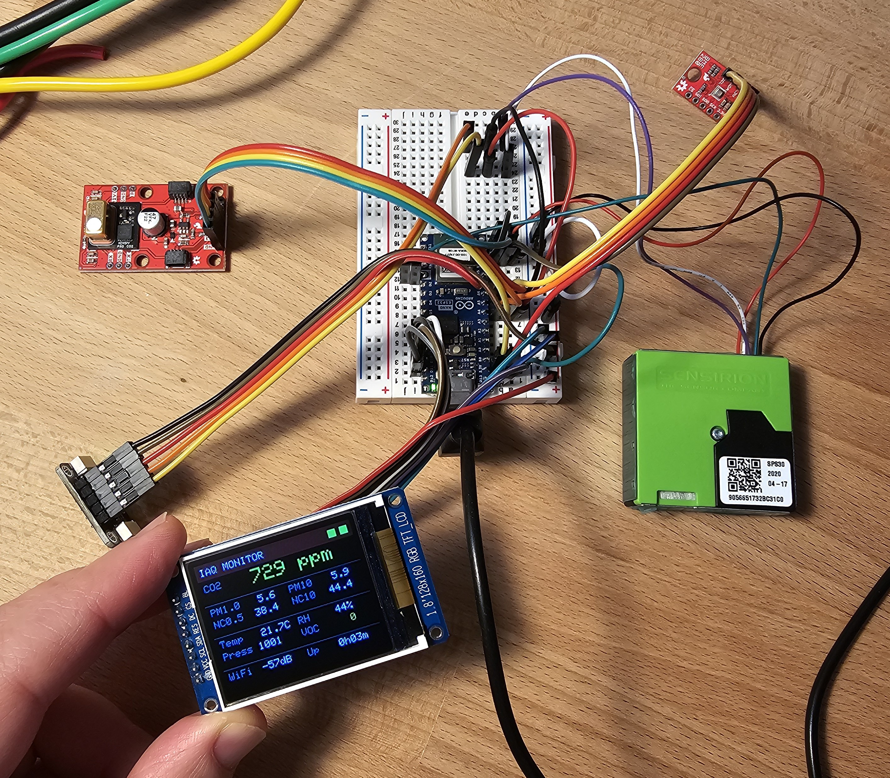
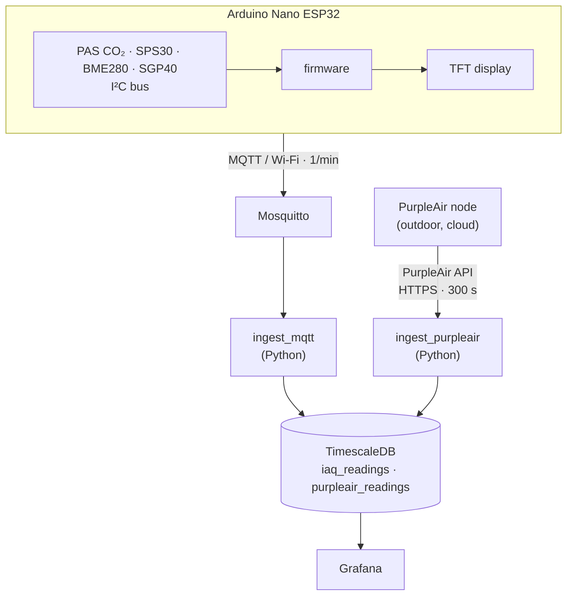
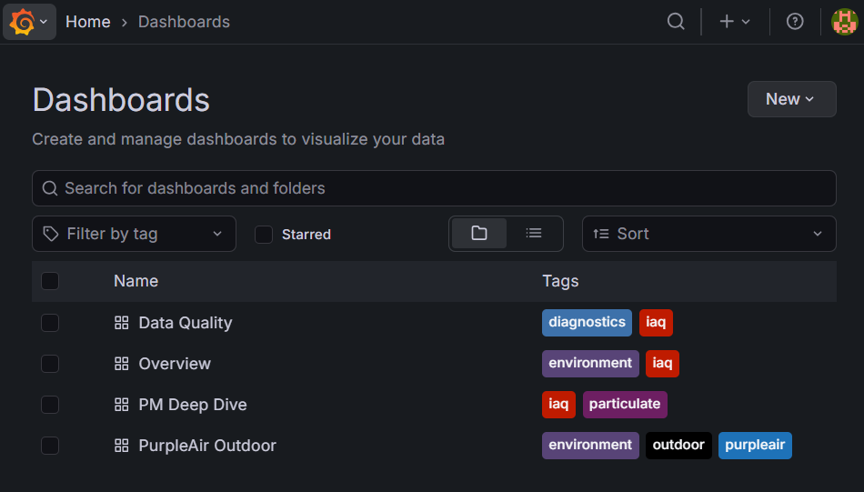
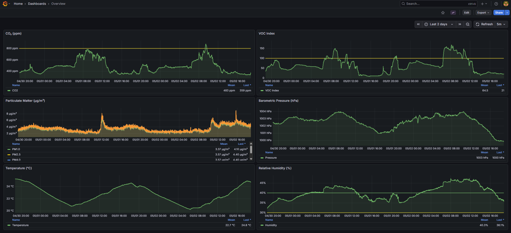
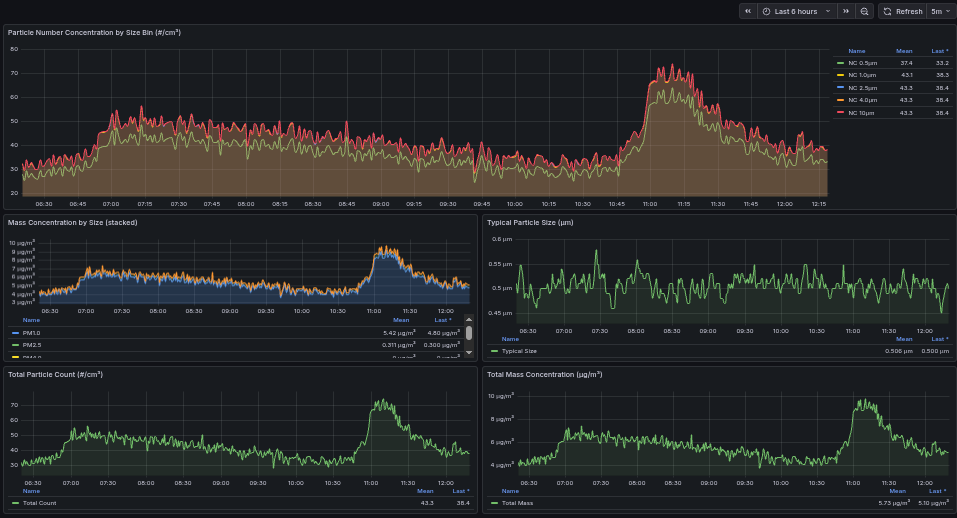
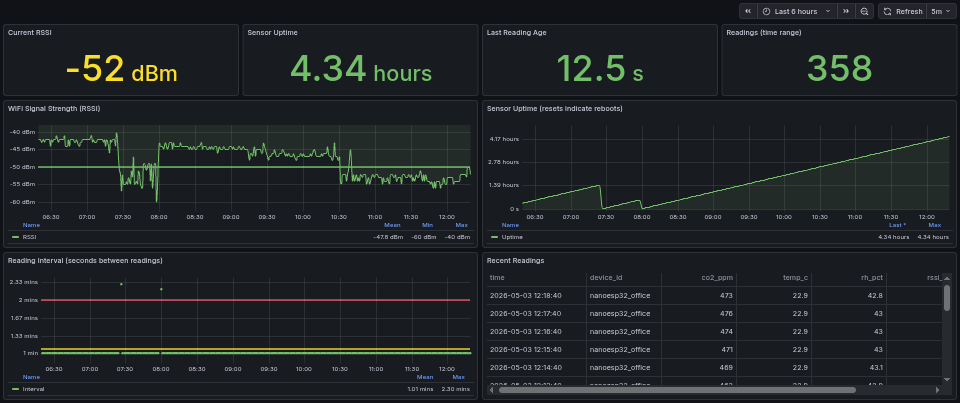
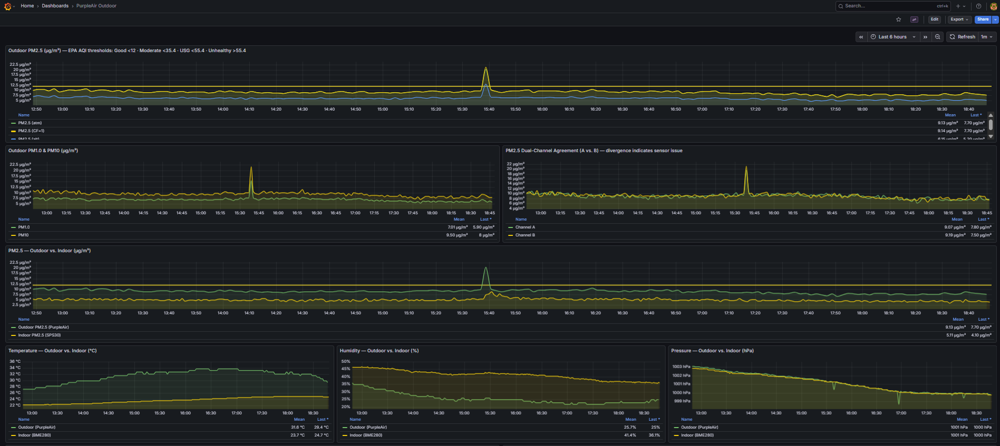
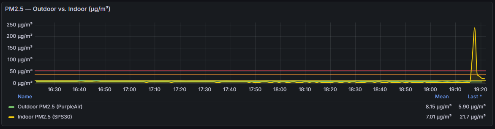

# Indoor + Outdoor Air Quality Monitor

A full-stack IoT air quality monitoring system built around an Arduino Nano ESP32, four I²C sensors, a TFT display, and a Dockerized backend on a Raspberry Pi. Indoor readings arrive via MQTT; outdoor readings come from a PurpleAir node polled through their API. Everything lands in TimescaleDB and is visualized in Grafana.

---

## Origin

This started with curiosity about Infineon's XENSIV PAS CO₂ — a photoacoustic CO₂ sensor — which I bought to see how it worked. That experiment turned into a proper indoor air quality node, and the indoor node eventually got an outdoor counterpart when I added a PurpleAir sensor outside.

The enclosure is still very much TBD. The system is in the "works well enough that I don't want to disturb the breadboard" phase of product development.



---

## What It Measures

### Indoor — Arduino Nano ESP32

| Sensor | Manufacturer | Measurements |
|--------|--------------|-------------|
| XENSIV PAS CO₂ | Infineon | CO₂ (ppm) — photoacoustic |
| SPS30 | Sensirion | PM1.0, PM2.5, PM4.0, PM10 mass (µg/m³); particle number concentrations; typical size (µm) |
| BME280 | Bosch | Temperature (°C), humidity (%), pressure (hPa) |
| SGP40 | Sensirion | VOC index (1–500) |

All four sensors share a single I²C bus. The ESP32 also drives a [JESSINIE 1.8" ST7735S](https://www.amazon.com/dp/B0D31BGJWF) (160×128, 3.3V) TFT display over SPI as a live local dashboard.

### Outdoor — PurpleAir

A PurpleAir node (dual Plantower PMS3003) reports to the PurpleAir cloud at ~2-minute intervals. A backend service polls the PurpleAir history API every 10 minutes (10-minute averages) and stores the readings locally alongside the indoor data. See [PurpleAir API Costs](#purpleair-api-costs) below for why polling is tuned conservatively.

---

## System Architecture



All backend services run in Docker on a Raspberry Pi. The database is not exposed outside the Docker network.

---

## Dashboards

Four dashboards are auto-provisioned at startup.



| Dashboard | What it shows |
|-----------|---------------|
| **Overview** | CO₂ (color-coded at 800/1200 ppm), PM2.5 (EPA AQI thresholds), all PM sizes, temperature, humidity, pressure |
| **PM Deep Dive** | Number concentrations by particle size (NC0.5 through NC10), typical particle size, total mass |
| **Data Quality** | Wi-Fi RSSI, sensor uptime, reading intervals — for catching sensor faults or connectivity issues |
| **PurpleAir Outdoor** | Outdoor PM, temperature, humidity; indoor vs. outdoor PM2.5 overlay |









---

## Quick Start

### Firmware

```bash
cp firmware/nano-esp32-iaq/secrets.example.h firmware/nano-esp32-iaq/secrets.h
# Edit secrets.h: WIFI_SSID, WIFI_PASS, MQTT_HOST, MQTT_PASS, DEVICE_ID
```

Install these libraries via the Arduino Library Manager:

- `pas-co2-ino` (Infineon XENSIV PAS CO₂)
- `Adafruit BME280 Library`
- `Sensirion I2C SPS30` + `Sensirion Core`
- `Sensirion I2C SGP40` + `Sensirion Core`
- `Sensirion Gas Index Algorithm`
- `PubSubClient` (MQTT)
- `Adafruit ST7735 and ST7789 Library` + `Adafruit GFX Library`

Upload to the Arduino Nano ESP32.

### Backend

```bash
cd infra
cp .env.example .env
# Edit .env — see comments in the file for each variable
docker compose --profile standalone up -d --build
```

This brings up the full self-contained stack, including a bundled TimescaleDB.
(The `standalone` profile is the normal way to run this project. The same
artifacts can instead attach to an external shared TimescaleDB cluster — set
`PG_HOST` in `.env` and omit the profile; see
[docs/deployment_raspberry_pi.md](docs/deployment_raspberry_pi.md).)

Grafana is at `http://<pi-ip>:3000`. Credentials are whatever you set in `.env`.

For remote access, Tailscale works well without any port forwarding — see [docs/security.md](docs/security.md).

### PurpleAir (optional)

If you have a PurpleAir sensor, set `PURPLEAIR_API_KEY`, `PURPLEAIR_SENSOR_INDEX`, and `PURPLEAIR_READ_KEY` in `.env`. On first start, `ingest_purpleair` backfills the last 24 hours automatically. Inserts use `ON CONFLICT DO NOTHING`, so restarts are safe.

You can run without PurpleAir — just remove or comment out the `ingest_purpleair` service in `docker-compose.yml` and ignore the outdoor dashboards.

---

## Hardware Notes

**CO₂ sensor power:** The PAS CO₂ needs both 12V (for the IR emitter) and 3.3V (for logic). The 12V rail was the first surprise when getting it running.

**I²C addresses:** BME280 at `0x77`, SPS30 at `0x69`, PAS CO₂ at `0x28`, SGP40 at `0x59`. All four share one bus at 100 kHz.

**TFT display:** [JESSINIE 1.8" ST7735S](https://www.amazon.com/dp/B0D31BGJWF) (160×128, 3.3V only) on SPI. Initialized with `INITR_GREENTAB` — other init modes produce wrong colors on the ST7735**S** variant. Shows a live summary with color-coded CO₂ and VOC thresholds; flicker-free updates rewrite only changed values.

**Firmware design:** Non-blocking polling with independent sensor intervals (SPS30 every 1s, BME280/SGP40 every 6s, CO₂ every 15s, publish every 60s). Ring-buffer averages smooth out noise. Stale readings map to `-1` in the payload, which the ingest service converts to `NULL` before inserting, so bad samples don't corrupt aggregates.

---

## PurpleAir API Costs

The outdoor side of this project depends on the PurpleAir API, which is a points-metered service. Worth understanding before you wire up your own sensor.

**Cost model.** Every call to the history endpoint costs `base (2 pt) + sum(field_costs) × rows_returned`. Averaged fields cost 2 pt/row, per-channel fields (`*_a`, `*_b`) cost 1 pt/row. Points are purchased on [develop.purpleair.com](https://develop.purpleair.com). The smallest purchase, `$10`, buys 1,000,000 points (i.e. 100k per dollar); volume discounts kick in above that, up to 1M per dollar at the `$5,000+` tier.

**Owner queries are not free.** A common (and intuitive) assumption is that querying your own sensor with your own API key shouldn't cost anything. It does. The history endpoint has no transparent owner-recognition — every call is billed against your point balance the same way as querying any public sensor.

**PurpleAir support is excellent.** They've been generous about granting free starter points to hobbyist and non-commercial users. If you're building something like this for personal use, it's worth emailing them with a brief description before purchasing — that's how this project got off the ground without a dent in the wallet.

**Why this implementation looks the way it does.** Because every call costs, `ingest_purpleair` is tuned for minimum draw at acceptable fidelity:

- **`average=10`** (10-minute server-side averaging) instead of real-time. Outdoor air rarely changes on minute timescales the way indoor air does, and dropping from `average=0` to `average=10` reduces rows-per-day ~5×. PurpleAir's own efficiency guide notes a 30× reduction going from real-time to hourly.
- **600-second poll interval**, matched to the averaging window. Polling more often than the data updates spends base cost without buying anything.
- **10 fields requested**, not 27. Anything not actually plotted in Grafana isn't fetched. Where channels (`_a`/`_b`) are already needed for sensor-health diagnostics, the pre-averaged sibling field is dropped (PurpleAir's guide explicitly recommends averaging A/B locally over paying for the pre-averaged value).

Steady-state draw under these settings: **~2.6 k pt/day, ~78 k pt/month** — about 12 months per million purchased points.

**Tunables** (all in `infra/docker-compose.yml`):

| Variable | Default | Effect |
|---|---|---|
| `PURPLEAIR_AVERAGE` | `10` | Server-side averaging in minutes (0=real-time ~2min, 10, 30, 60, 360, 1440, 10080). Higher values cost less per day at the cost of resolution. |
| `PURPLEAIR_POLL_INTERVAL` | `600` | Seconds between fetches. There's no benefit to polling faster than `PURPLEAIR_AVERAGE × 60`. |
| `PURPLEAIR_LOOKBACK_HOURS` | `24` | First-run / gap-recovery backfill window. |

If you want sub-10-minute fidelity, set `PURPLEAIR_AVERAGE=0` and `PURPLEAIR_POLL_INTERVAL=300`. Expect ~16 k pt/day in that mode.

---

## Project Structure

```
firmware/nano-esp32-iaq/        # Arduino firmware
  nano-esp32-iaq.ino
  secrets.example.h             # Copy to secrets.h and fill in

backend/ingest_mqtt/            # MQTT → TimescaleDB
backend/ingest_purpleair/       # PurpleAir API → TimescaleDB

infra/
  docker-compose.yml
  .env.example                  # Copy to .env and fill in
  mosquitto/                    # Broker config + hashed password file
  postgres/migrations/          # SQL migrations (idempotent, applied in order
  postgres/migrate.sh           #   by the one-shot migrate container)
  grafana/
    provisioning/               # Auto-provision datasource
    dashboards/                 # 4 JSON dashboard definitions

docs/                           # Architecture, schema, deployment, security
```

---

## Observations

**CO₂ as an occupancy signal.** CO₂ is a surprisingly good proxy for what's happening in a room. You can see someone enter, leave, open a door, or crack a window — each event has a recognizable shape in the time series.

**Soldering spikes PM hard.** The SPS30 reacts within seconds to electronics work. A brief soldering session produces a spike that looks far more alarming on the dashboard than it feels at the bench. The session below was done ~3 ft from the sensor, with a fume extractor running — it still pushed indoor PM2.5 to ~240 µg/m³ (well into the "hazardous" AQI range) before recovering in a few minutes.



**Humidifiers are surprisingly visible in PM data.** Running a humidifier in an adjacent room raises the NC0.5 baseline roughly 10×, from a typical 1–3 µg/m³ up to 20–30 µg/m³. The particles are water droplets, not pollution, but the optical sensor can't tell the difference.

**Cooking reaches the sensor even from across the house.** Frying in a kitchen well away from the sensor pushes the PM2.5 background to 15–20 µg/m³. Boiling or baking produces a smaller but still visible rise. Both effects only stand out because the baseline is so low — in a city apartment with higher ambient PM, they'd likely be buried in the noise.

**PurpleAir reads higher than calibrated instruments without correction.** The Plantower sensors inside PurpleAir report three PM2.5 values: CF=1 (factory/indoor calibration, reads highest), CF=ATM (outdoor-targeted, lower than CF=1 at high concentrations), and ALT (Lance Wallace's transparent optical-counting formula). All three read roughly 40% above EPA Federal Equivalent Method instruments on average. The EPA correction (Barkjohn et al. 2021) brings PurpleAir into much better agreement: `PM₂.₅ = 0.524 × CF1 − 0.0862 × RH + 5.75`, reducing RMSE from 8 to 3 µg/m³ and improving AQI category accuracy from 75% to 91%. Since both humidity and CF=1 are stored in `purpleair_readings`, this correction is applied directly in the Grafana SQL for the indoor/outdoor comparison.

**Indoor and outdoor PM sensors don't agree by default.** PurpleAir uses dual Plantower PMS3003 sensors; the SPS30 is a more expensive, factory-calibrated unit with a different optical geometry and correction factors. Getting them onto the same scale is an interesting measurement problem in itself.

**The value is in correlation.** CO₂ vs. occupancy, indoor PM2.5 vs. outdoor AQI, soldering events vs. recovery time, ventilation changes vs. CO₂ decay rate — none of this is visible until you have the data.

---

## Notes and Caveats

**VOC sensor:** The SGP40 is wired up and the index is stored, but I wouldn't add it again. The VOC index is noisy and hard to interpret without knowing what's actually in the air. Don't expect it to tell you much.

**PM4 and PM10 from the SPS30** are estimates extrapolated from the measured size distribution, not directly counted — the SPS30's optical geometry tops out around 10 µm but the larger bin values are modeled.

**Number concentrations are cumulative:** NC10 ≥ NC4 ≥ NC2.5 ≥ NC1 ≥ NC0.5.

---

## Further Reading

- [Architecture](docs/architecture.md)
- [Sensor details and field reference](docs/sensors.md)
- [Database schema](docs/db_schema.md)
- [Deployment on Raspberry Pi](docs/deployment_raspberry_pi.md)
- [Deployment on Windows (dev)](docs/deployment_windows.md)
- [Security model](docs/security.md)
