# System Architecture

This document describes the architecture of the IoT Environmental Monitoring System, which collects indoor and outdoor air quality data from sensors and provides real-time visualization.

## System Overview

The system follows a layered architecture with two parallel data flows — indoor (MQTT) and outdoor (PurpleAir HTTP API):

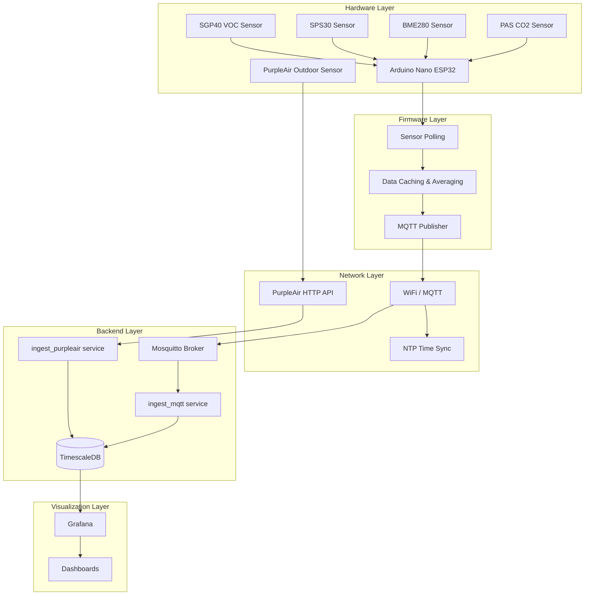
```mermaid
flowchart TB
    subgraph Hardware["Hardware Layer"]
        CO2[PAS CO2 Sensor]
        BME[BME280 Sensor]
        SPS[SPS30 Sensor]
        SGP[SGP40 VOC Sensor]
        ESP[Arduino Nano ESP32]
        PA[PurpleAir Outdoor Sensor]
    end

    subgraph Firmware["Firmware Layer"]
        POLL[Sensor Polling]
        CACHE[Data Caching & Averaging]
        PUB[MQTT Publisher]
    end

    subgraph Network["Network Layer"]
        WIFI[WiFi / MQTT]
        NTP[NTP Time Sync]
        HTTP[PurpleAir HTTP API]
    end

    subgraph Backend["Backend Layer"]
        MOSQ[Mosquitto Broker]
        INGEST[ingest_mqtt service]
        PAINGEST[ingest_purpleair service]
        DB[(TimescaleDB)]
    end

    subgraph Visualization["Visualization Layer"]
        GRAF[Grafana]
        DASH[Dashboards]
    end

    CO2 --> ESP
    BME --> ESP
    SPS --> ESP
    SGP --> ESP
    ESP --> POLL
    POLL --> CACHE
    CACHE --> PUB
    PUB --> WIFI
    WIFI --> NTP
    WIFI --> MOSQ
    MOSQ --> INGEST
    INGEST --> DB
    PA --> HTTP
    HTTP --> PAINGEST
    PAINGEST --> DB
    DB --> GRAF
    GRAF --> DASH
```

---

## Hardware Layer

### Sensors

The system uses four environmental sensors connected to an Arduino Nano ESP32 microcontroller:

| Sensor | Manufacturer | Measurements | Interface |
|--------|--------------|--------------|-----------|
| **PAS CO2** | Infineon XENSIV | CO2 concentration (ppm) | I2C |
| **BME280** | Bosch/Adafruit | Temperature, Humidity, Pressure | I2C |
| **SPS30** | Sensirion | Particulate Matter (PM1.0–PM10), Particle Counts | I2C |
| **SGP40** | Sensirion | VOC Index (1–500), raw SRAW signal | I2C |

### I2C Bus Topology

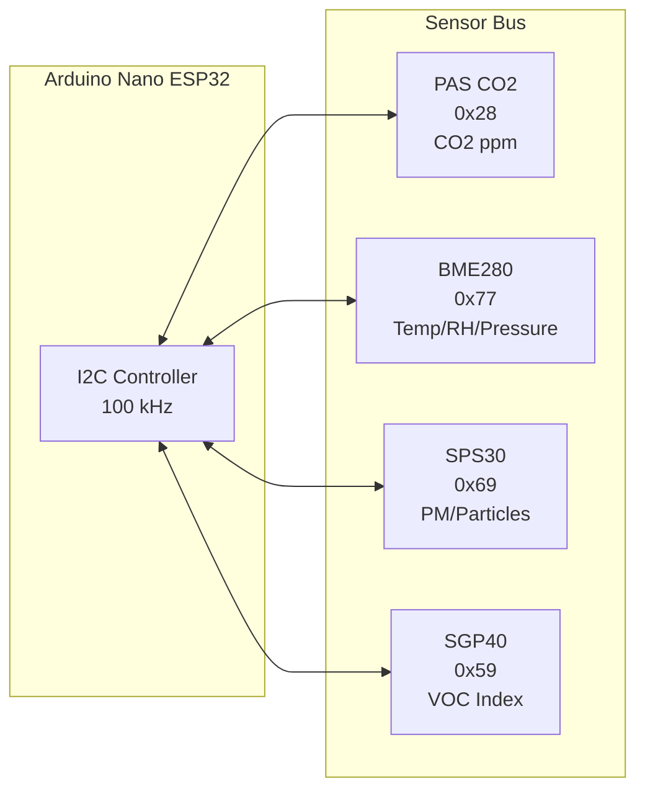
```mermaid
flowchart LR
    subgraph MCU["Arduino Nano ESP32"]
        I2C["I2C Controller<br/>100 kHz"]
    end

    subgraph Sensors["Sensor Bus"]
        CO2["PAS CO2<br/>0x28<br/>CO2 ppm"]
        BME["BME280<br/>0x77<br/>Temp/RH/Pressure"]
        SPS["SPS30<br/>0x69<br/>PM/Particles"]
        SGP["SGP40<br/>0x59<br/>VOC Index"]
    end

    I2C <--> CO2
    I2C <--> BME
    I2C <--> SPS
    I2C <--> SGP
```

### Sensor Capabilities

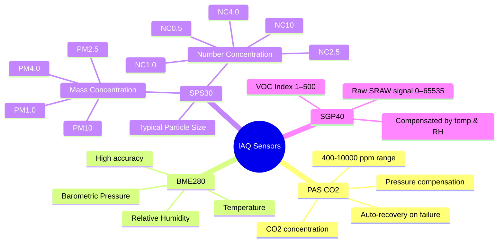
```mermaid
mindmap
    root((IAQ Sensors))
        PAS CO2
            CO2 concentration
            400-10000 ppm range
            Pressure compensation
            Auto-recovery on failure
        BME280
            Temperature
            Relative Humidity
            Barometric Pressure
            High accuracy
        SPS30
            Mass Concentration
                PM1.0
                PM2.5
                PM4.0
                PM10
            Number Concentration
                NC0.5
                NC1.0
                NC2.5
                NC4.0
                NC10
            Typical Particle Size
        SGP40
            Raw SRAW signal 0–65535
            VOC Index 1–500
            Compensated by temp & RH
```

---

## Firmware Architecture

### Main Loop Design

The firmware uses a non-blocking, polling-based architecture with independent timing intervals for each subsystem:

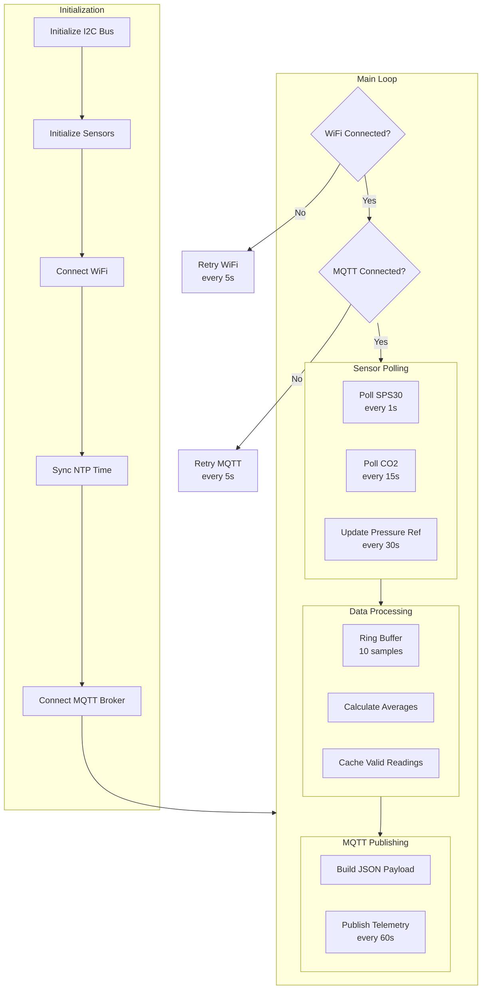
```mermaid
flowchart TB
    subgraph Init["Initialization"]
        I2C_INIT[Initialize I2C Bus]
        SENS_INIT[Initialize Sensors]
        WIFI_INIT[Connect WiFi]
        NTP_INIT[Sync NTP Time]
        MQTT_INIT[Connect MQTT Broker]
    end

    subgraph Loop["Main Loop"]
        CHECK_WIFI{WiFi Connected?}
        CHECK_MQTT{MQTT Connected?}

        subgraph Polling["Sensor Polling"]
            SPS_POLL[Poll SPS30<br/>every 1s]
            CO2_POLL[Poll CO2<br/>every 15s]
            PRESS_UPDATE[Update Pressure Ref<br/>every 30s]
        end

        subgraph Processing["Data Processing"]
            BUFFER[Ring Buffer<br/>10 samples]
            AVERAGE[Calculate Averages]
            CACHE[Cache Valid Readings]
        end

        subgraph Publishing["MQTT Publishing"]
            BUILD_JSON[Build JSON Payload]
            PUBLISH[Publish Telemetry<br/>every 60s]
        end
    end

    I2C_INIT --> SENS_INIT --> WIFI_INIT --> NTP_INIT --> MQTT_INIT --> Loop
    CHECK_WIFI -->|No| WIFI_RETRY[Retry WiFi<br/>every 5s]
    CHECK_WIFI -->|Yes| CHECK_MQTT
    CHECK_MQTT -->|No| MQTT_RETRY[Retry MQTT<br/>every 5s]
    CHECK_MQTT -->|Yes| Polling
    Polling --> Processing --> Publishing
```

### Timing Diagram

```mermaid
gantt
    title Firmware Polling Schedule (60-second window)
    dateFormat ss
    axisFormat %S

    section SPS30
    Poll 1  :p1, 00, 1s
    Poll 2  :p2, 01, 1s
    Poll 3  :p3, 02, 1s
    Poll... :p4, 03, 57s

    section CO2
    Poll 1  :c1, 00, 1s
    Poll 2  :c2, 15, 1s
    Poll 3  :c3, 30, 1s
    Poll 4  :c4, 45, 1s

    section Pressure
    Update 1 :pr1, 00, 1s
    Update 2 :pr2, 30, 1s

    section MQTT
    Publish :pub, 59, 1s
```

### CO2 Sensor Recovery

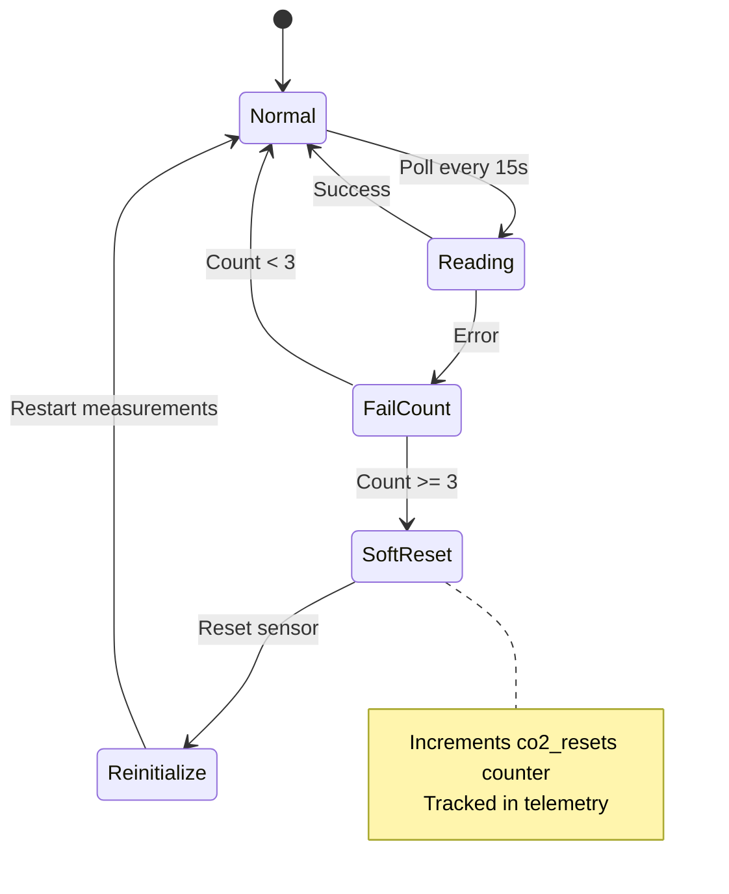
```mermaid
stateDiagram-v2
    [*] --> Normal

    Normal --> Reading: Poll every 15s
    Reading --> Normal: Success
    Reading --> FailCount: Error

    FailCount --> Normal: Count < 3
    FailCount --> SoftReset: Count >= 3

    SoftReset --> Reinitialize: Reset sensor
    Reinitialize --> Normal: Restart measurements

    note right of SoftReset
        Increments co2_resets counter
        Tracked in telemetry
    end note
```

---

## Network & Communication

### WiFi Connection

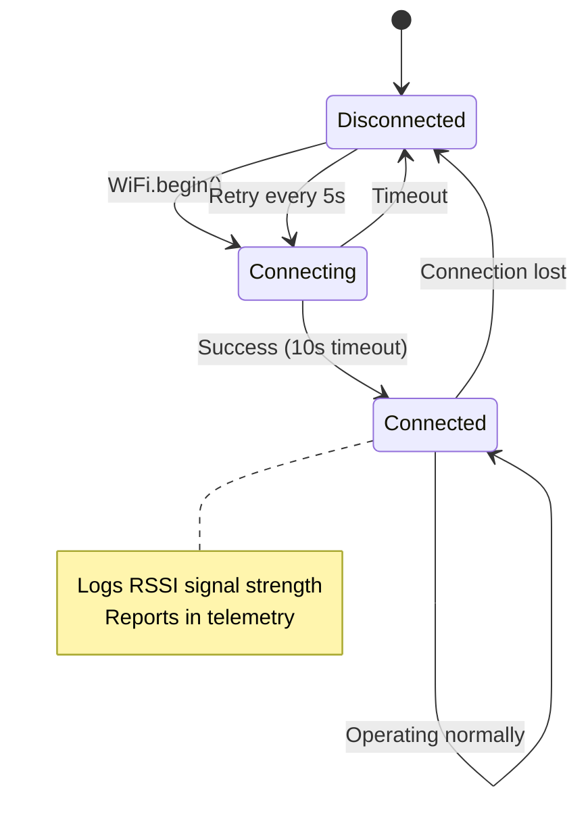
```mermaid
stateDiagram-v2
    [*] --> Disconnected

    Disconnected --> Connecting: WiFi.begin()
    Connecting --> Connected: Success (10s timeout)
    Connecting --> Disconnected: Timeout

    Connected --> Disconnected: Connection lost
    Connected --> Connected: Operating normally

    Disconnected --> Connecting: Retry every 5s

    note right of Connected
        Logs RSSI signal strength
        Reports in telemetry
    end note
```

### MQTT Topics

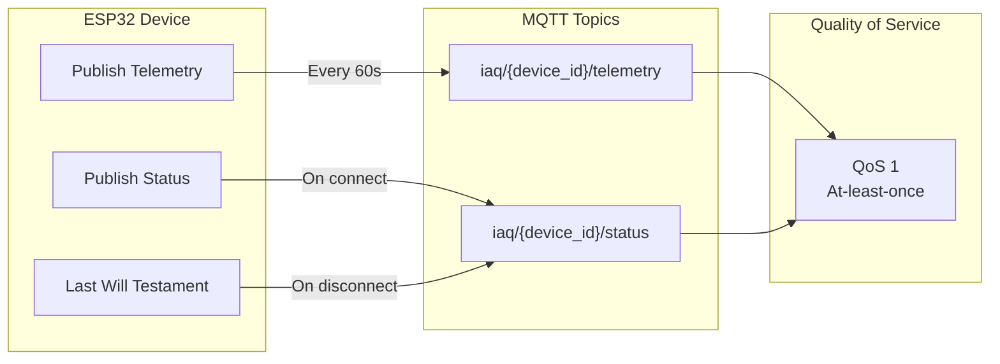
```mermaid
flowchart LR
    subgraph ESP32["ESP32 Device"]
        PUB_TEL[Publish Telemetry]
        PUB_STATUS[Publish Status]
        LWT[Last Will Testament]
    end

    subgraph Topics["MQTT Topics"]
        TEL["iaq/{device_id}/telemetry"]
        STATUS["iaq/{device_id}/status"]
    end

    subgraph QoS["Quality of Service"]
        QOS1[QoS 1<br/>At-least-once]
    end

    PUB_TEL -->|Every 60s| TEL
    PUB_STATUS -->|On connect| STATUS
    LWT -->|On disconnect| STATUS

    TEL --> QOS1
    STATUS --> QOS1
```

### Message Sequence

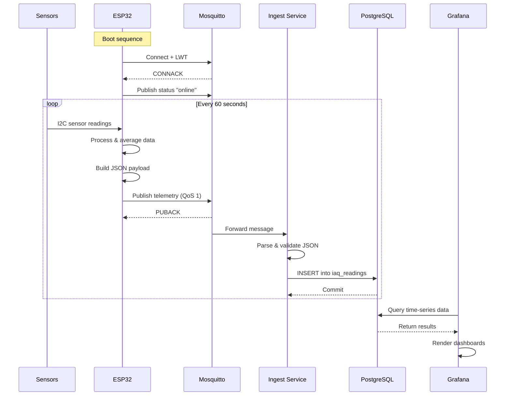
```mermaid
sequenceDiagram
    participant S as Sensors
    participant E as ESP32
    participant M as Mosquitto
    participant I as Ingest Service
    participant D as PostgreSQL
    participant G as Grafana

    Note over E: Boot sequence
    E->>M: Connect + LWT
    M-->>E: CONNACK
    E->>M: Publish status "online"

    loop Every 60 seconds
        S->>E: I2C sensor readings
        E->>E: Process & average data
        E->>E: Build JSON payload
        E->>M: Publish telemetry (QoS 1)
        M-->>E: PUBACK
        M->>I: Forward message
        I->>I: Parse & validate JSON
        I->>D: INSERT into iaq_readings
        D-->>I: Commit
    end

    G->>D: Query time-series data
    D-->>G: Return results
    G->>G: Render dashboards
```

---

## Backend Services

### Docker Stack

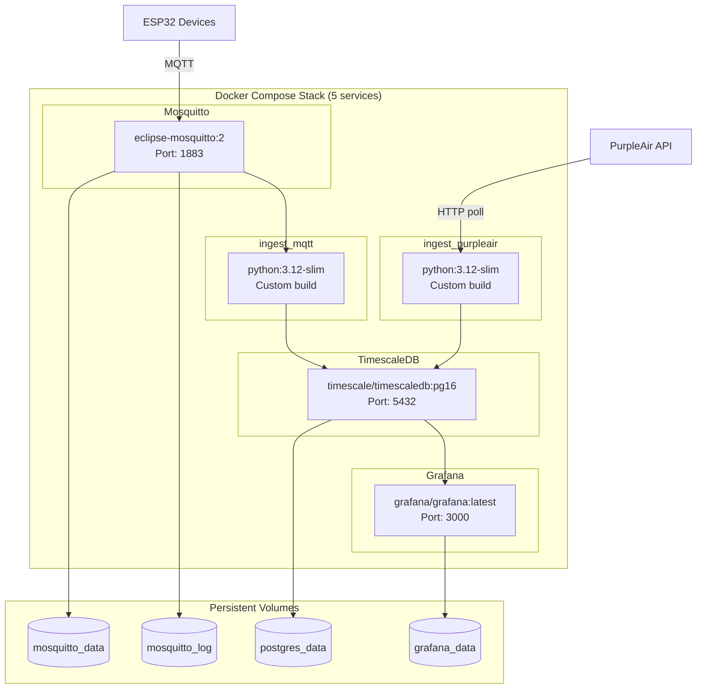
```mermaid
flowchart TB
    subgraph Docker["Docker Compose Stack (5 services)"]
        subgraph mosq["Mosquitto"]
            MQTT_SVC["eclipse-mosquitto:2<br/>Port: 1883"]
        end

        subgraph pg["TimescaleDB"]
            DB_SVC["timescale/timescaledb:pg16<br/>Port: 5432"]
        end

        subgraph ingest["ingest_mqtt"]
            PY_SVC["python:3.12-slim<br/>Custom build"]
        end

        subgraph paingest["ingest_purpleair"]
            PA_SVC["python:3.12-slim<br/>Custom build"]
        end

        subgraph graf["Grafana"]
            GRAF_SVC["grafana/grafana:latest<br/>Port: 3000"]
        end
    end

    subgraph Volumes["Persistent Volumes"]
        V_MOSQ[(mosquitto_data)]
        V_LOG[(mosquitto_log)]
        V_PG[(postgres_data)]
        V_GRAF[(grafana_data)]
    end

    ESP32["ESP32 Devices"] -->|MQTT| MQTT_SVC
    MQTT_SVC --> PY_SVC
    PY_SVC --> DB_SVC
    PA_API["PurpleAir API"] -->|HTTP poll| PA_SVC
    PA_SVC --> DB_SVC
    DB_SVC --> GRAF_SVC

    MQTT_SVC --> V_MOSQ
    MQTT_SVC --> V_LOG
    DB_SVC --> V_PG
    GRAF_SVC --> V_GRAF
```

### Service Dependencies

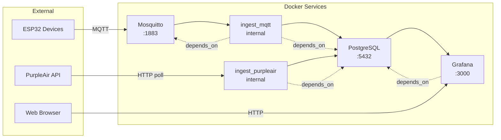
```mermaid
flowchart LR
    subgraph External["External"]
        ESP[ESP32 Devices]
        PA_API[PurpleAir API]
        USER[Web Browser]
    end

    subgraph Services["Docker Services"]
        MOSQ[Mosquitto<br/>:1883]
        PG[PostgreSQL<br/>:5432]
        INGEST[ingest_mqtt<br/>internal]
        PAINGEST[ingest_purpleair<br/>internal]
        GRAF[Grafana<br/>:3000]
    end

    ESP -->|MQTT| MOSQ
    MOSQ --> INGEST
    INGEST --> PG
    PA_API -->|HTTP poll| PAINGEST
    PAINGEST --> PG
    PG --> GRAF
    USER -->|HTTP| GRAF

    INGEST -.->|depends_on| MOSQ
    INGEST -.->|depends_on| PG
    PAINGEST -.->|depends_on| PG
    GRAF -.->|depends_on| PG
```

### Ingestion Service Architecture

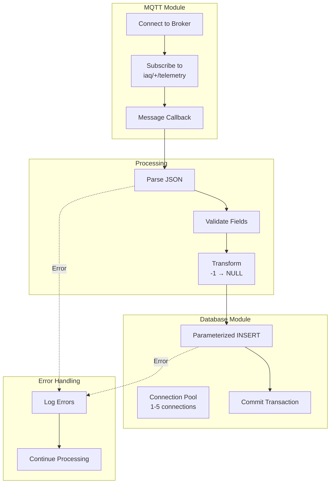
```mermaid
flowchart TB
    subgraph MQTT["MQTT Module"]
        CONNECT[Connect to Broker]
        SUBSCRIBE["Subscribe to<br/>iaq/+/telemetry"]
        CALLBACK[Message Callback]
    end

    subgraph Processing["Processing"]
        PARSE[Parse JSON]
        VALIDATE[Validate Fields]
        TRANSFORM["Transform<br/>-1 → NULL"]
    end

    subgraph Database["Database Module"]
        POOL["Connection Pool<br/>1-5 connections"]
        INSERT[Parameterized INSERT]
        COMMIT[Commit Transaction]
    end

    subgraph Error["Error Handling"]
        LOG_ERR[Log Errors]
        CONTINUE[Continue Processing]
    end

    CONNECT --> SUBSCRIBE --> CALLBACK
    CALLBACK --> PARSE --> VALIDATE --> TRANSFORM
    TRANSFORM --> INSERT --> COMMIT
    PARSE -.->|Error| LOG_ERR --> CONTINUE
    INSERT -.->|Error| LOG_ERR
```

---

## Data Pipeline

### End-to-End Flow

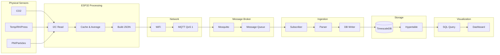
```mermaid
flowchart LR
    subgraph Sensors["Physical Sensors"]
        S1[CO2]
        S2[Temp/RH/Press]
        S3[PM/Particles]
    end

    subgraph ESP["ESP32 Processing"]
        READ[I2C Read]
        CACHE[Cache & Average]
        JSON[Build JSON]
    end

    subgraph Network["Network"]
        WIFI[WiFi]
        MQTT[MQTT QoS 1]
    end

    subgraph Broker["Message Broker"]
        MOSQ[Mosquitto]
        QUEUE[Message Queue]
    end

    subgraph Ingest["Ingestion"]
        SUB[Subscriber]
        PARSE[Parser]
        WRITE[DB Writer]
    end

    subgraph Storage["Storage"]
        TSDB[(TimescaleDB)]
        HYPER[Hypertable]
    end

    subgraph Visual["Visualization"]
        QUERY[SQL Query]
        DASH[Dashboard]
    end

    S1 --> READ
    S2 --> READ
    S3 --> READ
    READ --> CACHE --> JSON --> WIFI --> MQTT --> MOSQ --> QUEUE
    QUEUE --> SUB --> PARSE --> WRITE --> TSDB --> HYPER
    HYPER --> QUERY --> DASH
```

### Payload Transformation

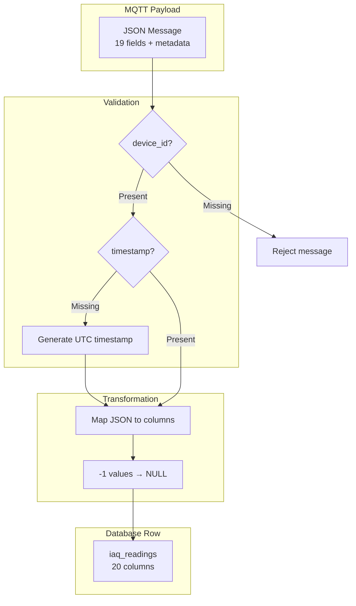
```mermaid
flowchart TB
    subgraph Input["MQTT Payload"]
        JSON_IN["JSON Message<br/>19 fields + metadata"]
    end

    subgraph Validation["Validation"]
        CHECK_DEV{device_id?}
        CHECK_TS{timestamp?}
        GEN_TS[Generate UTC timestamp]
    end

    subgraph Transform["Transformation"]
        MAP[Map JSON to columns]
        NULL_CONV["-1 values → NULL"]
    end

    subgraph Output["Database Row"]
        ROW["iaq_readings<br/>20 columns"]
    end

    JSON_IN --> CHECK_DEV
    CHECK_DEV -->|Missing| REJECT[Reject message]
    CHECK_DEV -->|Present| CHECK_TS
    CHECK_TS -->|Missing| GEN_TS --> MAP
    CHECK_TS -->|Present| MAP
    MAP --> NULL_CONV --> ROW
```

---

## Database Schema

### Entity Relationship

Two hypertables store all sensor readings. See `docs/db_schema.md` for full column listings.

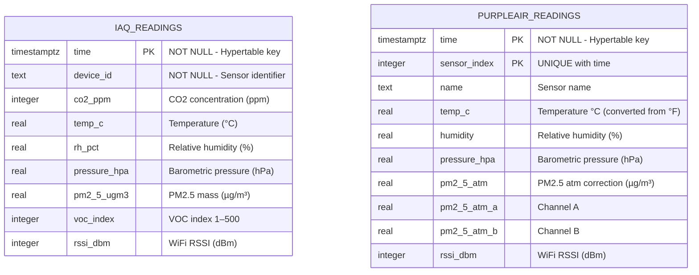
```mermaid
erDiagram
    IAQ_READINGS {
        timestamptz time PK "NOT NULL - Hypertable key"
        text device_id "NOT NULL - Sensor identifier"
        integer co2_ppm "CO2 concentration (ppm)"
        real temp_c "Temperature (°C)"
        real rh_pct "Relative humidity (%)"
        real pressure_hpa "Barometric pressure (hPa)"
        real pm2_5_ugm3 "PM2.5 mass (µg/m³)"
        integer voc_index "VOC index 1–500"
        integer rssi_dbm "WiFi RSSI (dBm)"
    }

    PURPLEAIR_READINGS {
        timestamptz time PK "NOT NULL - Hypertable key"
        integer sensor_index PK "UNIQUE with time"
        text name "Sensor name"
        real temp_c "Temperature °C (converted from °F)"
        real humidity "Relative humidity (%)"
        real pressure_hpa "Barometric pressure (hPa)"
        real pm2_5_atm "PM2.5 atm correction (µg/m³)"
        real pm2_5_atm_a "Channel A"
        real pm2_5_atm_b "Channel B"
        integer rssi_dbm "WiFi RSSI (dBm)"
    }
```

### Index Strategy

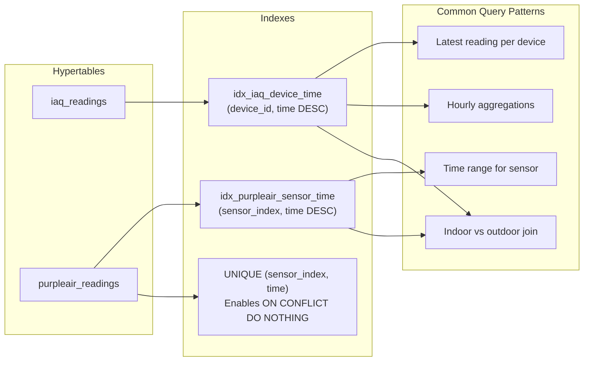
```mermaid
flowchart LR
    subgraph Tables["Hypertables"]
        IAQ["iaq_readings"]
        PA["purpleair_readings"]
    end

    subgraph Indexes["Indexes"]
        IDX1["idx_iaq_device_time<br/>(device_id, time DESC)"]
        IDX2["idx_purpleair_sensor_time<br/>(sensor_index, time DESC)"]
        UNIQ["UNIQUE (sensor_index, time)<br/>Enables ON CONFLICT DO NOTHING"]
    end

    subgraph Queries["Common Query Patterns"]
        Q1[Latest reading per device]
        Q2[Time range for sensor]
        Q3[Hourly aggregations]
        Q4[Indoor vs outdoor join]
    end

    IAQ --> IDX1
    PA --> IDX2
    PA --> UNIQ
    IDX1 --> Q1
    IDX2 --> Q2
    IDX1 --> Q3
    IDX2 --> Q4
    IDX1 --> Q4
```

---

## Visualization Layer

### Dashboard Organization

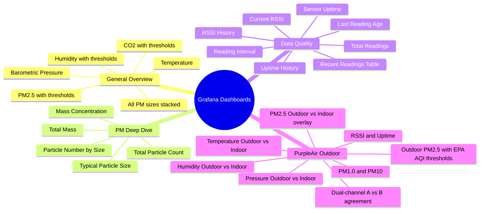
```mermaid
mindmap
    root((Grafana Dashboards))
        General Overview
            CO2 with thresholds
            PM2.5 with thresholds
            All PM sizes stacked
            Barometric Pressure
            Temperature
            Humidity with thresholds
        PM Deep Dive
            Particle Number by Size
            Mass Concentration
            Typical Particle Size
            Total Particle Count
            Total Mass
        Data Quality
            Current RSSI
            Sensor Uptime
            Last Reading Age
            Total Readings
            RSSI History
            Uptime History
            Reading Interval
            Recent Readings Table
        PurpleAir Outdoor
            Outdoor PM2.5 with EPA AQI thresholds
            PM1.0 and PM10
            Dual-channel A vs B agreement
            PM2.5 Outdoor vs Indoor overlay
            Temperature Outdoor vs Indoor
            Humidity Outdoor vs Indoor
            Pressure Outdoor vs Indoor
            RSSI and Uptime
```

### Dashboard Data Flow

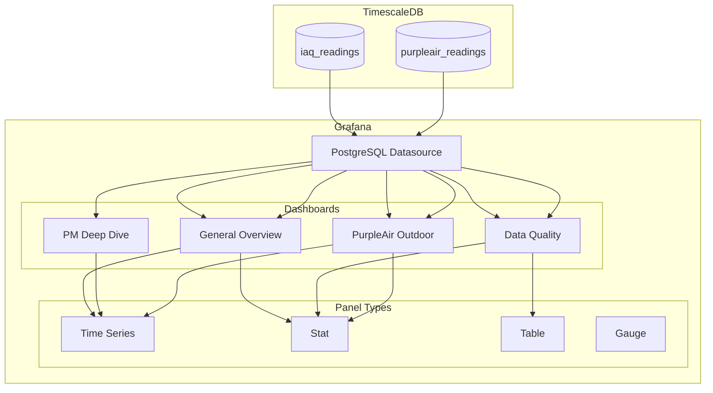
```mermaid
flowchart TB
    subgraph Grafana["Grafana"]
        DS[PostgreSQL Datasource]

        subgraph Dashboards["Dashboards"]
            D1[General Overview]
            D2[PM Deep Dive]
            D3[Data Quality]
            D4[PurpleAir Outdoor]
        end

        subgraph Panels["Panel Types"]
            TS[Time Series]
            STAT[Stat]
            TABLE[Table]
            GAUGE[Gauge]
        end
    end

    subgraph DB["TimescaleDB"]
        HYPER[(iaq_readings)]
        PAHYPER[(purpleair_readings)]
    end

    HYPER --> DS
    PAHYPER --> DS
    DS --> D1 --> TS
    DS --> D1 --> STAT
    DS --> D2 --> TS
    DS --> D3 --> STAT
    DS --> D3 --> TABLE
    DS --> D4 --> TS
    DS --> D4 --> STAT
```

---

## Deployment Architecture

### Platform Support

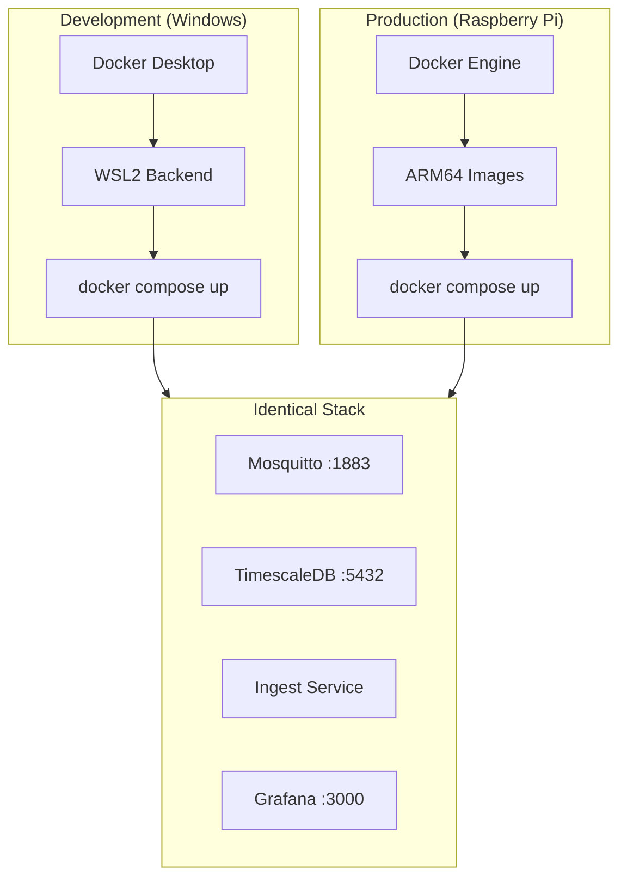
```mermaid
flowchart TB
    subgraph Dev["Development (Windows)"]
        DD[Docker Desktop]
        WSL[WSL2 Backend]
        COMPOSE_WIN[docker compose up]
    end

    subgraph Prod["Production (Raspberry Pi)"]
        DOCKER_PI[Docker Engine]
        ARM64[ARM64 Images]
        COMPOSE_PI[docker compose up]
    end

    subgraph Stack["Identical Stack"]
        S1[Mosquitto :1883]
        S2[TimescaleDB :5432]
        S3[Ingest Service]
        S4[Grafana :3000]
    end

    DD --> WSL --> COMPOSE_WIN --> Stack
    DOCKER_PI --> ARM64 --> COMPOSE_PI --> Stack
```

### Network Ports

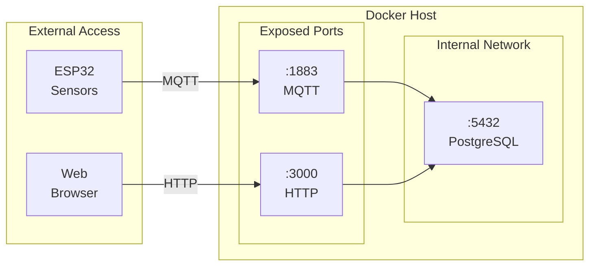
```mermaid
flowchart LR
    subgraph External["External Access"]
        ESP[ESP32<br/>Sensors]
        BROWSER[Web<br/>Browser]
    end

    subgraph Docker["Docker Host"]
        subgraph Exposed["Exposed Ports"]
            P1883[":1883<br/>MQTT"]
            P3000[":3000<br/>HTTP"]
        end

        subgraph Internal["Internal Network"]
            P5432[":5432<br/>PostgreSQL"]
        end
    end

    ESP -->|MQTT| P1883
    BROWSER -->|HTTP| P3000
    P1883 --> P5432
    P3000 --> P5432
```

### Volume Persistence

```mermaid
flowchart TB
    subgraph Containers["Docker Containers"]
        MOSQ[Mosquitto]
        PG[PostgreSQL]
        GRAF[Grafana]
    end

    subgraph Volumes["Named Volumes"]
        V1[(mosquitto_data)]
        V2[(mosquitto_log)]
        V3[(postgres_data)]
        V4[(grafana_data)]
    end

    subgraph Data["Persisted Data"]
        D1[MQTT Messages<br/>Subscriptions]
        D2[Broker Logs]
        D3[Time-series Data<br/>Schema]
        D4[Dashboards<br/>Users<br/>Preferences]
    end

    MOSQ --> V1 --> D1
    MOSQ --> V2 --> D2
    PG --> V3 --> D3
    GRAF --> V4 --> D4
```

---

## Summary

This IoT environmental monitoring system provides:

- **Dual data sources**: indoor Arduino/MQTT and outdoor PurpleAir HTTP API
- **Robust sensor integration** with automatic recovery mechanisms (CO2 soft-reset, MQTT reconnect, idempotent HTTP history ingestion)
- **Efficient data pipeline** from sensors to visualization
- **Scalable architecture** using 5 containerized services
- **Cross-platform deployment** on Windows and Raspberry Pi
- **Comprehensive monitoring** through four Grafana dashboards including indoor/outdoor comparisons
