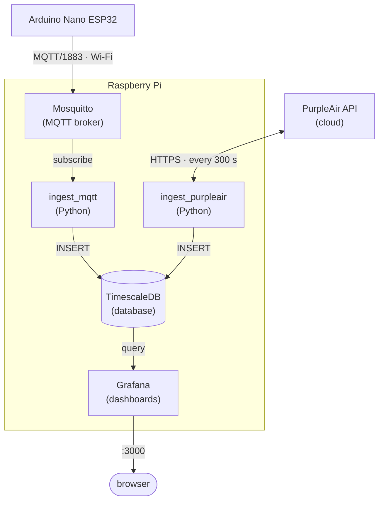

# Deploying IAQ Monitoring on Raspberry Pi

Complete guide for deploying the Indoor Air Quality monitoring stack on Raspberry Pi as a headless server.

## Prerequisites

- **Hardware**: Raspberry Pi 4 or 5 (4GB+ RAM recommended)
- **Storage**: 32GB+ microSD card (A2 rated) or USB SSD
- **OS**: Raspberry Pi OS (64-bit) - Bookworm or newer
- **Network**: Ethernet or Wi-Fi connection

## Architecture Overview

The stack consists of 5 services:

| Service | Port | Description |
|---------|------|-------------|
| Mosquitto | 1883 | MQTT broker for indoor sensor data |
| TimescaleDB | 5432 | PostgreSQL with time-series extensions |
| ingest_mqtt | - | Python service: MQTT → Database (indoor) |
| ingest_purpleair | - | Python service: PurpleAir HTTP API → Database (outdoor) |
| Grafana | 3000 | Dashboards and visualization |

All images have native ARM64 support.

## Step 1: Prepare Raspberry Pi OS

### 1.1 Flash the OS

Use Raspberry Pi Imager to flash Raspberry Pi OS (64-bit) to your SD card or SSD.

In Imager settings (gear icon), configure:
- Hostname: `iaq-server`
- Enable SSH with password or public key
- Set username and password
- Configure Wi-Fi (if not using Ethernet)

### 1.2 First Boot and Update

SSH into your Pi:

```bash
ssh pi@iaq-server.local
```

Update the system:

```bash
sudo apt update && sudo apt upgrade -y
```

### 1.3 Configure Static IP (Recommended)

Edit the DHCP client configuration:

```bash
sudo nano /etc/dhcpcd.conf
```

Add at the end (adjust addresses for your network):

```
interface eth0
static ip_address=192.168.1.100/24
static routers=192.168.1.1
static domain_name_servers=192.168.1.1 8.8.8.8
```

For Wi-Fi, replace `eth0` with `wlan0`.

Reboot:

```bash
sudo reboot
```

## Step 2: Install Docker

### 2.1 Install using the convenience script

```bash
curl -fsSL https://get.docker.com -o get-docker.sh
sudo sh get-docker.sh
rm get-docker.sh
```

### 2.2 Add your user to the docker group

```bash
sudo usermod -aG docker $USER
```

Log out and back in, or run:

```bash
newgrp docker
```

### 2.3 Enable Docker on boot

```bash
sudo systemctl enable docker
sudo systemctl enable containerd
```

### 2.4 Verify installation

```bash
docker --version
docker compose version
docker run --rm hello-world
```

## Step 3: Performance Tuning

### 3.1 Enable swap (if not already enabled)

Check current swap:

```bash
free -h
```

If swap is 0, create a swapfile:

```bash
sudo fallocate -l 2G /swapfile
sudo chmod 600 /swapfile
sudo mkswap /swapfile
sudo swapon /swapfile
echo '/swapfile none swap sw 0 0' | sudo tee -a /etc/fstab
```

### 3.2 Adjust swappiness for better performance

```bash
echo 'vm.swappiness=10' | sudo tee -a /etc/sysctl.conf
sudo sysctl -p
```

### 3.3 Memory limits (for 2GB Pi only)

If running on a 2GB Pi, add memory limits to `infra/docker-compose.yml`:

```yaml
services:
  postgres:
    mem_limit: 512m
  grafana:
    mem_limit: 256m
  ingest:
    mem_limit: 128m
```

## Step 4: Clone and Deploy

### 4.1 Install Git and clone repository

```bash
sudo apt install git -y
git clone https://github.com/YOUR_USERNAME/env_monitoring.git
cd env_monitoring
```

### 4.2 Configure credentials

The stack uses environment variables for all credentials. A `.env` file with generated passwords has been created:

```bash
cd infra
cat .env  # Review the generated passwords
```

**Important**: Save these passwords somewhere secure. You'll need:
- `GRAFANA_ADMIN_PASSWORD` for Grafana login
- `MQTT_PASSWORD` for the Arduino firmware

**PurpleAir credentials** must be added to `infra/.env`:

```bash
PURPLEAIR_API_KEY=<your_account_read_api_key>
PURPLEAIR_SENSOR_INDEX=<your_sensor_index>
PURPLEAIR_READ_KEY=<your_per_sensor_read_key>
```

- `PURPLEAIR_API_KEY` — your account-level Read API key (from purpleair.com → Profile → API access)
- `PURPLEAIR_SENSOR_INDEX` — numeric sensor ID shown on the sensor detail page
- `PURPLEAIR_READ_KEY` — per-sensor read key (required for private sensors; found on sensor detail page)

The `ingest_purpleair` service polls the PurpleAir history endpoint every 300 seconds, checks the last stored timestamp in the DB, and fetches all readings since then. On first start it backfills up to `PURPLEAIR_LOOKBACK_HOURS` (default 24h) of history.

### 4.3 Start the services

```bash
docker compose up -d
```

First run will:
- Pull ARM64 images (~500MB total)
- Build the ingest service
- Initialize the TimescaleDB database schema
- Provision Grafana dashboards

This may take several minutes on first run. Monitor progress:

```bash
docker compose logs -f
```

Press `Ctrl+C` to exit logs.

## Step 5: Verify Deployment

### 5.1 Check container status

```bash
docker compose ps
```

All 5 services should show `running`.

### 5.2 Test MQTT broker

```bash
# Install MQTT client tools
sudo apt install mosquitto-clients -y

# Get the MQTT password from .env
source .env

# Subscribe in one terminal
mosquitto_sub -h localhost -u iaq -P "$MQTT_PASSWORD" -t "iaq/+/telemetry" -v

# Publish test message in another terminal
mosquitto_pub -h localhost -u iaq -P "$MQTT_PASSWORD" -t "iaq/test/telemetry" -m '{"device_id":"test","co2_ppm":450}'
```

### 5.3 Verify database

```bash
docker exec -it postgres psql -U iaq -d iaq -c "\dt"
```

### 5.4 Access Grafana

From any device on the same network, open:

```
http://192.168.1.100:3000
```

(Replace with your Pi's IP address)

Login: `admin` / `admin`

## Step 6: Configure Firewall (Optional)

If you use UFW:

```bash
sudo apt install ufw -y
sudo ufw allow ssh
sudo ufw allow 1883/tcp  # MQTT
sudo ufw allow 3000/tcp  # Grafana
# Only if external database access needed:
# sudo ufw allow 5432/tcp
sudo ufw enable
```

## Step 7: Configure the Sensor

Update the firmware to point to your Raspberry Pi:

1. Find your Pi's IP address:
   ```bash
   hostname -I
   ```

2. Get the MQTT password from `.env`:
   ```bash
   cat infra/.env | grep MQTT_PASSWORD
   ```

3. Edit `firmware/nano-esp32-iaq/secrets.h`:
   ```cpp
   #define MQTT_HOST "192.168.1.100"
   #define MQTT_PORT 1883
   #define MQTT_USER "iaq"
   #define MQTT_PASS "your_mqtt_password_from_env"
   ```

4. Flash the firmware to your Arduino Nano ESP32

5. Watch for incoming data:
   ```bash
   source infra/.env
   mosquitto_sub -h localhost -u iaq -P "$MQTT_PASSWORD" -t "iaq/+/telemetry" -v
   ```

## Service Access

From devices on the same network (replace IP as needed):

| Service | URL/Address | Credentials |
|---------|-------------|-------------|
| Grafana | http://192.168.1.100:3000 | admin / (see `GRAFANA_ADMIN_PASSWORD` in .env) |
| MQTT Broker | 192.168.1.100:1883 | iaq / (see `MQTT_PASSWORD` in .env) |
| TimescaleDB | Internal only | Not exposed externally |

## Running as a System Service

The Docker stack is configured for automatic recovery after power loss or reboot:

1. **Restart policies**: All services use `restart: unless-stopped`, meaning Docker will automatically restart containers after a crash or reboot
2. **Data persistence**: Named volumes preserve all data (database, Grafana settings, MQTT state)

### Enable Docker on Boot

Ensure Docker starts automatically when the Pi boots:

```bash
sudo systemctl enable docker
sudo systemctl enable containerd
```

Verify they're enabled:

```bash
systemctl is-enabled docker      # Should output: enabled
systemctl is-enabled containerd  # Should output: enabled
```

### Verify After Reboot

```bash
sudo reboot
# After reboot, SSH back in
docker compose ps  # All 5 services should show "running"
```

### If Containers Don't Auto-Start

Check Docker status:

```bash
sudo systemctl status docker
```

If Docker is running but containers aren't, start them manually:

```bash
cd ~/env_monitoring/infra
docker compose up -d
```

## Common Commands

```bash
# View all logs
docker compose logs -f

# View specific service logs
docker compose logs -f ingest

# Restart a single service
docker compose restart ingest

# Stop all services
docker compose down

# Stop and delete all data (fresh start)
docker compose down -v

# Rebuild after code changes
docker compose up -d --build

# Check database row count
docker exec postgres psql -U iaq -d iaq -c "SELECT COUNT(*) FROM iaq_readings"

# Recent indoor readings
docker exec postgres psql -U iaq -d iaq -c "SELECT time, device_id, co2_ppm, temp_c FROM iaq_readings ORDER BY time DESC LIMIT 5"

# Recent outdoor readings
docker exec postgres psql -U iaq -d iaq -c "SELECT time, pm2_5_atm, temp_c, humidity FROM purpleair_readings ORDER BY time DESC LIMIT 5"

# PurpleAir ingest logs
docker compose logs -f ingest_purpleair

# System resource usage
docker stats --no-stream
```

## Monitoring the Pi

### Check system resources

```bash
# CPU temperature
vcgencmd measure_temp

# Memory usage
free -h

# Disk usage
df -h

# Docker container resources
docker stats --no-stream
```

### Enable temperature monitoring in Grafana

You can add Pi system metrics by installing node_exporter and Prometheus, but that's beyond the scope of this guide.

## Troubleshooting

### Services not starting after reboot

Check Docker status:

```bash
sudo systemctl status docker
docker compose ps
```

If services aren't running:

```bash
cd ~/env_monitoring/infra
docker compose up -d
```

### Out of memory errors

1. Check memory usage:
   ```bash
   free -h
   docker stats --no-stream
   ```

2. Add/increase swap space

3. Add memory limits to docker-compose.yml

### Slow performance

1. Use USB SSD instead of SD card for better I/O
2. Ensure adequate cooling (heatsink/fan)
3. Check CPU throttling:
   ```bash
   vcgencmd get_throttled
   ```
   (0x0 means no throttling)

### Sensor data not arriving

1. Check MQTT is receiving data:
   ```bash
   source infra/.env
   mosquitto_sub -h localhost -u iaq -P "$MQTT_PASSWORD" -t "#" -v
   ```

2. Verify sensor can reach Pi:
   - Same network/VLAN?
   - Firewall blocking port 1883?

3. Check ingest logs:
   ```bash
   docker compose logs -f ingest
   ```

### PurpleAir data not arriving

1. Check logs for API errors:
   ```bash
   docker compose logs -f ingest_purpleair
   ```

2. Common errors:
   - `403 ApiKeyInvalidError` — wrong `PURPLEAIR_API_KEY` (must be account-level, not per-sensor read key)
   - `403 SensorNotFoundError` with read_key — wrong `PURPLEAIR_READ_KEY` or `PURPLEAIR_SENSOR_INDEX`
   - `429` — rate limit exceeded; service will back off automatically

3. Verify outdoor data in DB:
   ```bash
   docker exec postgres psql -U iaq -d iaq -c "SELECT COUNT(*), MAX(time) FROM purpleair_readings"
   ```

4. If the `purpleair_readings` table doesn't exist on an existing DB, apply the migration:
   ```bash
   docker exec -i postgres psql -U iaq -d iaq < infra/postgres/init/004_add_purpleair.sql
   docker exec -i postgres psql -U iaq -d iaq < infra/postgres/init/005_purpleair_drop_unavailable_cols.sql
   ```

### Database disk space

Check TimescaleDB size:

```bash
docker exec postgres psql -U iaq -d iaq -c "SELECT pg_size_pretty(pg_database_size('iaq'))"
```

To reduce size, consider adding data retention policies with TimescaleDB.

### Fresh reinstall

```bash
cd ~/env_monitoring/infra
docker compose down -v
docker compose up -d
```

## Updating

Pull latest changes and rebuild:

```bash
cd ~/env_monitoring
git pull
cd infra
docker compose down
docker compose up -d --build
```

## Remote Access with Tailscale

Tailscale provides secure remote access to your Pi from anywhere without port forwarding.

### Install Tailscale on Raspberry Pi

```bash
curl -fsSL https://tailscale.com/install.sh | sh
sudo tailscale up
```

Follow the authentication link to connect your Pi to your Tailscale account.

### Install Tailscale on Client Devices

- **Windows/Mac**: Download from https://tailscale.com/download
- **Phone**: Install Tailscale app from App Store / Play Store
- Log in with the same account as your Pi

### Access Services Remotely

After Tailscale is connected on both devices:

```bash
# Find your Pi's Tailscale IP
tailscale ip -4
```

Then access services from anywhere:

| Service | URL |
|---------|-----|
| Grafana | http://<pi-tailscale-ip>:3000 |
| SSH | ssh user@<pi-tailscale-ip> |

### Optional: Enable Tailscale SSH

For passwordless SSH through Tailscale:

```bash
sudo tailscale up --ssh
```

Then SSH with: `ssh user@<pi-tailscale-hostname>`

## Backup and Restore

### Backup database

```bash
docker exec postgres pg_dump -U iaq iaq > backup_$(date +%Y%m%d).sql
```

### Restore database

```bash
cat backup_20240101.sql | docker exec -i postgres psql -U iaq -d iaq
```

## Network Diagram


