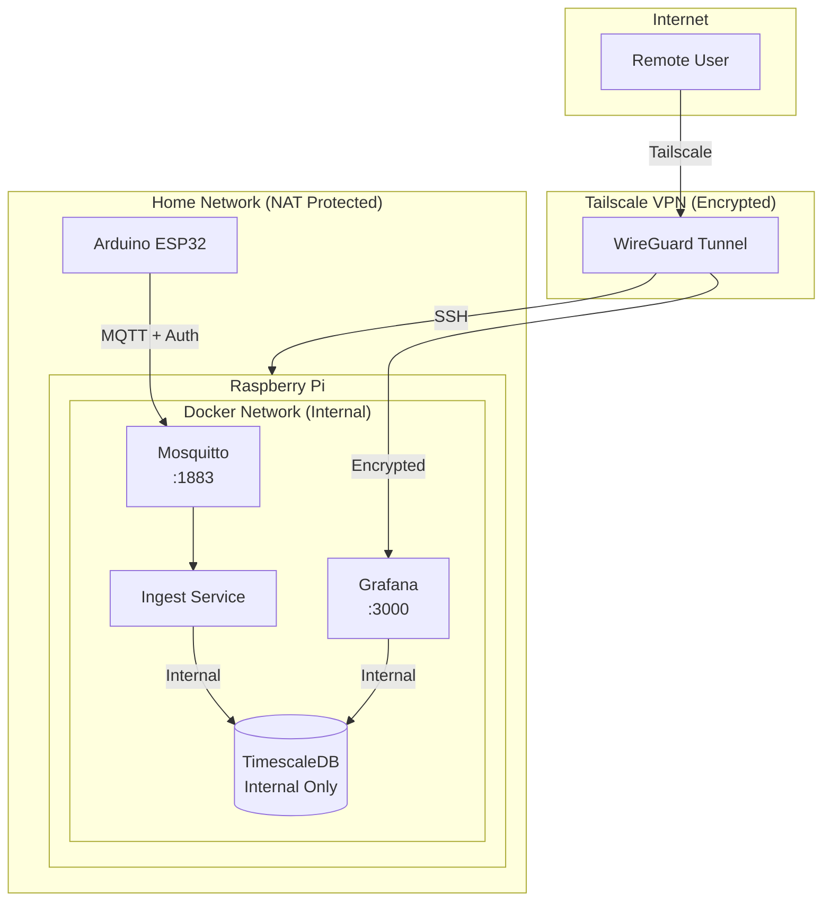
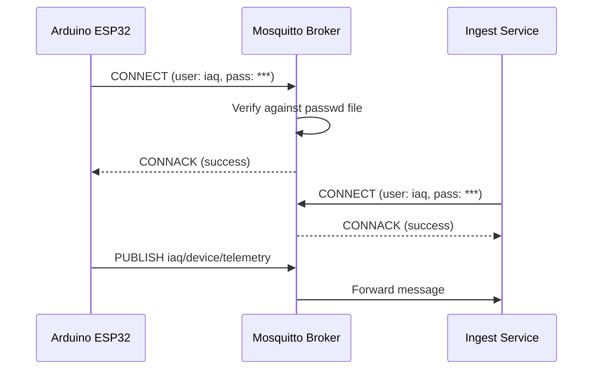
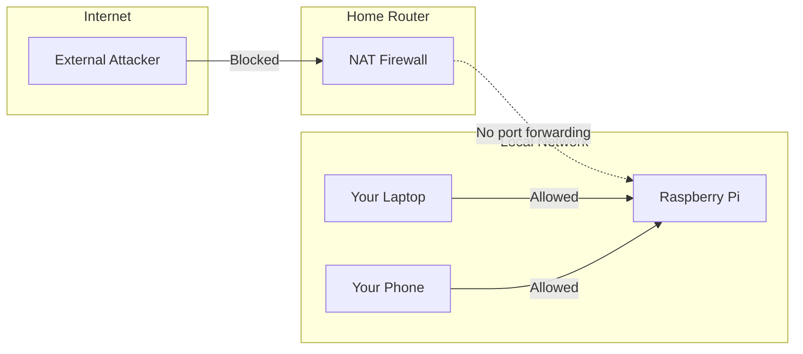
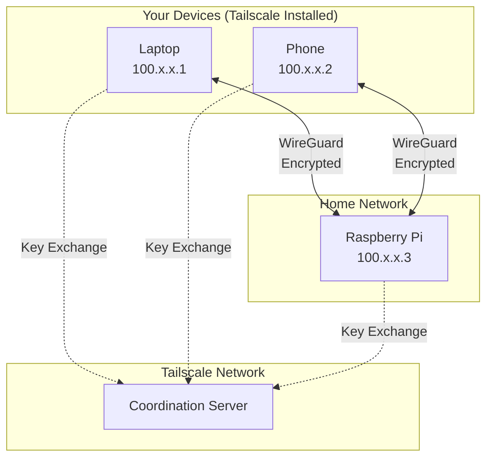

# Security Guide

This document describes the security architecture of the IAQ monitoring system and provides setup instructions for secure deployment.

## Security Overview

The system implements defense-in-depth with multiple security layers:



### Security Features

| Layer | Protection |
|-------|------------|
| Network | Home router NAT blocks unsolicited inbound traffic |
| Remote Access | Tailscale VPN with WireGuard encryption |
| MQTT | Username/password authentication required |
| Grafana | Admin password authentication |
| Database | Not exposed externally, internal Docker network only |
| Credentials | Stored in `.env` file (gitignored) |

## Authentication

### MQTT Broker (Mosquitto)

All MQTT clients must authenticate with username and password:



**Configuration files:**
- `infra/mosquitto/mosquitto.conf` - Enables authentication
- `infra/mosquitto/passwd` - Hashed password file

### MQTT ACL Design Note

The default ACL (`infra/mosquitto/acl`) uses a single shared `iaq` user with `readwrite` access to all device topics. This is fine for a single-sensor deployment but has a limitation: any device with the MQTT password can publish to any other device's topic.

For multi-sensor deployments, consider per-device ACLs:

```
# Per-device write-only credentials (one entry per sensor)
user esp32_bedroom
topic write iaq/esp32_bedroom/telemetry
topic write iaq/esp32_bedroom/status

user esp32_office
topic write iaq/esp32_office/telemetry
topic write iaq/esp32_office/status

# Ingest service: read-only access to all device topics
user ingest
topic read iaq/+/telemetry
topic read iaq/+/status
```

This way a compromised device credential cannot spoof readings from other sensors, and the ingest service cannot publish.

### Grafana

Grafana requires authentication to access dashboards:

- Default username: `admin`
- Password: Set via `GRAFANA_ADMIN_PASSWORD` in `.env`

### PostgreSQL/TimescaleDB

The database is **not exposed** to the network. It's only accessible within the Docker network by:
- Ingest service (writes sensor data)
- Grafana (reads for dashboards)

## Network Security

### Default Protection (Local Network)

By default, services are only accessible from your local WiFi network:



### Remote Access (Tailscale VPN)

Tailscale creates an encrypted mesh network for secure remote access:



**Benefits:**
- No port forwarding required
- Works through NAT and firewalls
- End-to-end encryption (WireGuard)
- Zero-config after initial setup

## Credentials Management

### Environment Variables

All credentials are stored in `infra/.env` (gitignored):

```bash
# PostgreSQL password
POSTGRES_PASSWORD=<strong-random-password>

# Grafana admin password
GRAFANA_ADMIN_PASSWORD=<strong-random-password>

# MQTT credentials
MQTT_USER=iaq
MQTT_PASSWORD=<strong-random-password>
```

### Generating Strong Passwords

```bash
# Generate a 24-character random password
openssl rand -base64 24

# Or using Python
python -c "import secrets; import string; print(''.join(secrets.choice(string.ascii_letters + string.digits) for _ in range(24)))"
```

### Where Credentials Are Used

| Credential | Used By |
|------------|---------|
| `POSTGRES_PASSWORD` | PostgreSQL, Ingest service, Grafana datasource |
| `GRAFANA_ADMIN_PASSWORD` | Grafana web UI login |
| `MQTT_USER` / `MQTT_PASSWORD` | Arduino firmware, Ingest service |

## Setup Walkthrough

### Step 1: Create Environment File

```bash
cd infra

# Create .env file with strong passwords
cat > .env << 'EOF'
POSTGRES_PASSWORD=$(openssl rand -base64 24)
GRAFANA_ADMIN_PASSWORD=$(openssl rand -base64 24)
MQTT_USER=iaq
MQTT_PASSWORD=$(openssl rand -base64 24)
EOF

# View generated passwords (save these!)
cat .env
```

### Step 2: Deploy the Stack

```bash
docker compose up -d
```

### Step 3: Configure Arduino Firmware

Edit `firmware/nano-esp32-iaq/secrets.h`:

```cpp
#define WIFI_SSID "your_wifi_ssid"
#define WIFI_PASS "your_wifi_password"

#define MQTT_HOST "192.168.x.x"  // Pi's IP address
#define MQTT_PORT 1883
#define MQTT_USER "iaq"
#define MQTT_PASS "your_mqtt_password_from_env"  // From MQTT_PASSWORD in .env
```

Flash the firmware to your Arduino.

### Step 4: Install Tailscale (Remote Access)

**On Raspberry Pi:**

```bash
curl -fsSL https://tailscale.com/install.sh | sh
sudo tailscale up
```

Follow the authentication link to connect to your Tailscale account.

**On your laptop/phone:**

1. Download Tailscale from https://tailscale.com/download
2. Sign in with the same account
3. Access services via Pi's Tailscale IP:
   - Grafana: `http://<tailscale-ip>:3000`
   - SSH: `ssh user@<tailscale-ip>`

Find the Tailscale IP:
```bash
tailscale ip -4
```

### Step 5: Verify Security

```bash
# Verify MQTT requires authentication (should fail)
mosquitto_pub -h localhost -t "test" -m "test"
# Expected: Connection refused (not authorized)

# Verify with credentials (should succeed)
source .env
mosquitto_pub -h localhost -u iaq -P "$MQTT_PASSWORD" -t "test" -m "test"
```

## Security Checklist

Use this checklist when deploying:

- [ ] Generated strong, unique passwords in `infra/.env`
- [ ] Verified `.env` is gitignored (not committed to repo)
- [ ] Updated Arduino `secrets.h` with MQTT credentials
- [ ] Flashed updated firmware to Arduino
- [ ] Verified MQTT rejects anonymous connections
- [ ] Verified Grafana login works with new password
- [ ] Installed Tailscale on Pi (if remote access needed)
- [ ] Installed Tailscale on client devices
- [ ] Saved passwords in a secure location (password manager)

## Threat Model

### Protected Against

| Threat | Mitigation |
|--------|------------|
| Internet-based attacks | NAT blocks unsolicited inbound |
| MQTT message injection | Authentication required |
| Dashboard tampering | Grafana authentication |
| Credential leakage | `.env` gitignored, not in repo |
| Man-in-the-middle (remote) | Tailscale WireGuard encryption |

### Not Protected Against (Accepted Risks)

| Risk | Rationale |
|------|-----------|
| Local network attackers | Trusted home network assumption |
| Physical access to Pi | Physical security out of scope |
| Unencrypted local MQTT | Low risk on trusted LAN |

## Rotating Credentials

To rotate passwords:

1. Generate new passwords
2. Update `infra/.env`
3. Update PostgreSQL password in running database:
   ```bash
   docker exec postgres psql -U iaq -c "ALTER USER iaq WITH PASSWORD 'new_password';"
   ```
4. Restart services: `docker compose restart`
5. Update Arduino `secrets.h` and reflash firmware
