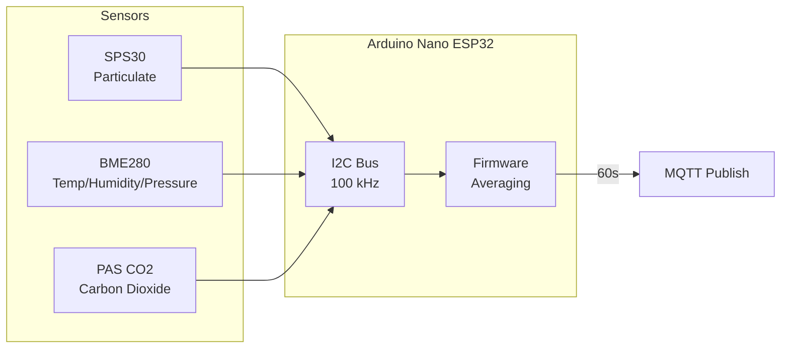
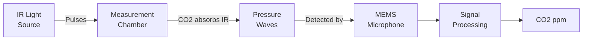
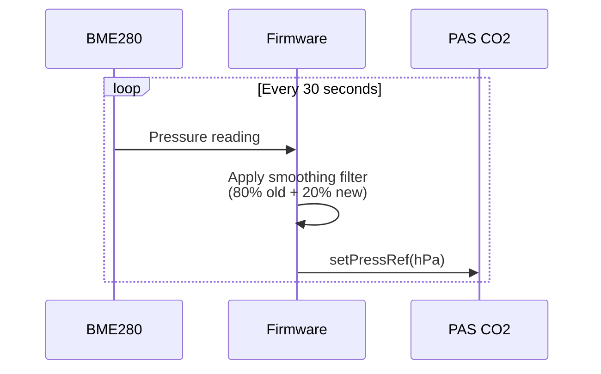
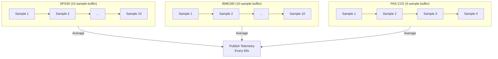
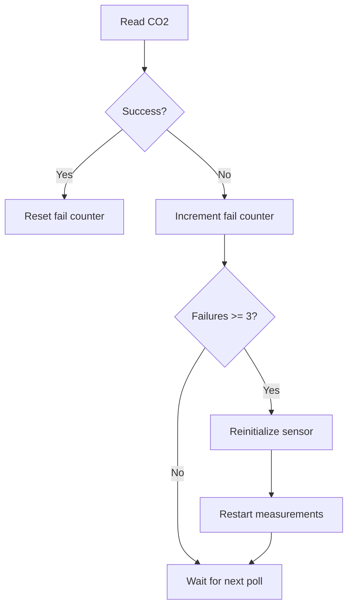

# Sensor Data Reference

This document describes the sensors used in the IAQ monitoring system, their specifications, limitations, and how the firmware processes their data.

## Sensor Overview

| Sensor | Measures | Interface | I2C Address | Manufacturer |
|--------|----------|-----------|-------------|--------------|
| [SPS30](#sensirion-sps30-particulate-matter) | Particulate matter (PM1, PM2.5, PM4, PM10) | I2C | 0x69 | Sensirion |
| [BME280](#bosch-bme280-environmental) | Temperature, humidity, pressure | I2C | 0x77 | Bosch |
| [PAS CO2](#infineon-xensiv-pas-co2) | Carbon dioxide concentration | I2C | 0x28 | Infineon |
| [SGP40](#sensirion-sgp40-voc) | VOC index | I2C | 0x59 | Sensirion |
| [ST7735S TFT](#st7735s-tft-display--jessinie-18) | Display | SPI | N/A | Sitronix / JESSINIE |



---

## Sensirion SPS30 (Particulate Matter)

### Specifications

| Parameter | Value |
|-----------|-------|
| Technology | Laser scattering |
| Mass concentration range | 0 - 1000 µg/m³ |
| Mass concentration accuracy | ±10 µg/m³ (0-100), ±10% (100-1000) |
| Number concentration range | 0 - 3000 #/cm³ |
| Particle size range | 0.3 - 10 µm |
| Lifetime | >8 years continuous operation |

### Output Values

The SPS30 outputs both **mass concentrations** (µg/m³) and **number concentrations** (#/cm³):

| Output | Unit | Description |
|--------|------|-------------|
| `pm1_0_ugm3` | µg/m³ | Mass concentration PM1.0 |
| `pm2_5_ugm3` | µg/m³ | Mass concentration PM2.5 |
| `pm4_0_ugm3` | µg/m³ | Mass concentration PM4.0 |
| `pm10_ugm3` | µg/m³ | Mass concentration PM10 |
| `nc0_5_pcm3` | #/cm³ | Number concentration < 0.5 µm |
| `nc1_0_pcm3` | #/cm³ | Number concentration < 1.0 µm |
| `nc2_5_pcm3` | #/cm³ | Number concentration < 2.5 µm |
| `nc4_0_pcm3` | #/cm³ | Number concentration < 4.0 µm |
| `nc10_pcm3` | #/cm³ | Number concentration < 10 µm |
| `typical_size_um` | µm | Typical particle size |

### Important: Number Concentrations Are Cumulative

The number concentration values are **cumulative** - each value includes all particles smaller than the specified size:

```
NC10 ≥ NC4 ≥ NC2.5 ≥ NC1 ≥ NC0.5
```

For example, if you see:
```json
{
  "nc0_5_pcm3": 8.5,
  "nc1_0_pcm3": 10.1,
  "nc2_5_pcm3": 10.2,
  "nc4_0_pcm3": 10.2,
  "nc10_pcm3": 10.2
}
```

This means:
- 8.5 particles/cm³ are smaller than 0.5 µm
- 1.6 particles/cm³ are between 0.5-1.0 µm (10.1 - 8.5)
- 0.1 particles/cm³ are between 1.0-2.5 µm (10.2 - 10.1)
- No particles detected between 2.5-10 µm

### Limitations & Caveats

1. **PM4 and PM10 are estimated, not measured**
   - The sensor's sampling statistics for larger particles are too low for direct measurement
   - PM4 and PM10 values are extrapolated from PM0.5, PM1, and PM2.5 using assumed size distributions
   - These estimates may be inaccurate for unusual aerosol compositions

2. **Calibrated for specific aerosol types**
   - Factory calibration uses potassium chloride (KCl) and Arizona Test Dust
   - Different aerosol types (cooking smoke, pollen, etc.) may have different optical properties
   - Mass concentration accuracy depends on particle density and refractive index

3. **Minimum detection size is 0.3 µm**
   - Ultrafine particles (<0.3 µm) are not detected
   - NC0.5 actually means "particles between 0.3 and 0.5 µm"

4. **Requires periodic fan cleaning**
   - Built-in fan can accumulate dust over years
   - Automatic fan cleaning can be triggered via command

### Data Sources
- [Sensirion SPS30 Datasheet](https://cdn.sparkfun.com/assets/2/d/2/a/6/Sensirion_SPS30_Particulate_Matter_Sensor_v0.9_D1__1_.pdf)
- [Laboratory Evaluation of Low-Cost Optical Particle Counters (PMC)](https://pmc.ncbi.nlm.nih.gov/articles/PMC8233711/)

---

## Bosch BME280 (Environmental)

### Specifications

| Parameter | Range | Accuracy |
|-----------|-------|----------|
| Temperature | -40 to +85°C | ±1.0°C |
| Humidity | 0 - 100% RH | ±3% RH |
| Pressure | 300 - 1100 hPa | ±1 hPa absolute, ±0.12 hPa relative |

### Output Values

| Output | Unit | Description |
|--------|------|-------------|
| `temp_c` | °C | Ambient temperature |
| `rh_pct` | % | Relative humidity |
| `pressure_hpa` | hPa | Barometric pressure |

### Limitations & Caveats

1. **Self-heating affects temperature readings**
   - The sensor generates heat during operation
   - Temperature readings may be 1-2°C higher than ambient in enclosed spaces
   - Best accuracy achieved with low sampling rates and good ventilation

2. **Humidity accuracy degrades at extremes**
   - ±3% RH accuracy is specified for 20-80% RH at 25°C
   - At <20% or >80% RH, accuracy degrades
   - Very high humidity exposure can cause temporary drift

3. **Pressure accuracy varies with temperature**
   - Full ±1 hPa accuracy only in 0-65°C range
   - Outside this range, accuracy drops to ±1.7 hPa

4. **Temperature affects humidity readings**
   - Relative humidity is temperature-dependent
   - Self-heating error propagates to humidity readings

5. **Response time**
   - Temperature and pressure: ~1 second
   - Humidity: ~1 second (63% step response)

### Data Sources
- [Bosch BME280 Datasheet](https://www.bosch-sensortec.com/media/boschsensortec/downloads/datasheets/bst-bme280-ds002.pdf)
- [Bosch BME280 Product Page](https://www.bosch-sensortec.com/products/environmental-sensors/humidity-sensors-bme280/)

---

## Infineon XENSIV PAS CO2

### Specifications

| Parameter | Value |
|-----------|-------|
| Technology | Photoacoustic spectroscopy (PAS) |
| Measurement range | 0 - 32,000 ppm |
| Accuracy (400-5000 ppm) | ±30 ppm ±3% of reading |
| Response time (T63) | 75 seconds |
| Lifetime | 10 years |
| Operating voltage | 12V + 3.3V |

### Output Values

| Output | Unit | Description |
|--------|------|-------------|
| `co2_ppm` | ppm | CO2 concentration |
| `co2_age_s` | seconds | Time since last valid reading |
| `co2_resets` | count | Number of sensor soft resets |

### How It Works

Unlike traditional NDIR sensors, the PAS CO2 uses a photoacoustic principle:



1. Pulsed infrared light enters the measurement chamber
2. CO2 molecules absorb specific IR wavelengths
3. Absorbed energy creates tiny pressure waves
4. MEMS microphone detects the acoustic signal
5. Signal strength correlates to CO2 concentration

### Pressure Compensation

CO2 readings are affected by barometric pressure. The firmware automatically compensates:



### Limitations & Caveats

1. **Accuracy only specified for 400-5000 ppm**
   - Below 400 ppm: accuracy not guaranteed
   - Above 5000 ppm: accuracy degrades
   - Outdoor air (~420 ppm) is at the edge of the specified range

2. **Long response time (75 seconds)**
   - The sensor is slow compared to fast-changing CO2 levels
   - Rapid breathing or window opening won't show immediate changes
   - Best for tracking trends, not instantaneous events

3. **Requires pressure compensation**
   - Without pressure reference, readings can drift
   - The firmware updates pressure reference every 30 seconds

4. **Baseline drift requires correction**
   - Sensor accuracy drifts ~1% per year
   - Two correction methods available:
     - **ABOC** (Automatic Baseline Offset Correction): Assumes sensor sees fresh air periodically
     - **FCS** (Forced Calibration Scheme): Manual calibration with known CO2 concentration

5. **Sensitive to vibration**
   - MEMS microphone can pick up mechanical vibrations
   - Mount sensor away from vibration sources

6. **12V power required**
   - Unlike most I2C sensors, requires 12V for the IR emitter
   - Plus 3.3V for digital logic

### Diagnostic Fields

The firmware reports diagnostic data to help identify sensor issues:

| Field | Meaning |
|-------|---------|
| `co2_age_s` | Seconds since last successful reading. If >60, something is wrong. |
| `co2_resets` | Number of automatic sensor resets. High values indicate instability. |

### Data Sources
- [Infineon PAS CO2 Datasheet](https://www.infineon.com/dgdl/Infineon-PASCO2V01-DataSheet-v01_70-EN.pdf)
- [XENSIV PAS CO2 FAQs](https://community.infineon.com/t5/Knowledge-Base-Articles/XENSIV-PAS-CO2-sensor-FAQs/ta-p/290372)
- [Compensation Techniques (ABOC/FCS)](https://community.infineon.com/t5/Knowledge-Base-Articles/XENSIV-PAS-CO2-sensor-compensation-techniques-ABOC-and-FCS/ta-p/968416)

---

## Firmware Data Processing

### Polling Intervals

Each sensor is polled at a different rate optimized for its characteristics:

| Sensor | Poll Interval | Samples per Publish | Rationale |
|--------|---------------|---------------------|-----------|
| SPS30 | 1 second | ~60 samples | Fast response, high noise |
| BME280 | 6 seconds | ~10 samples | Moderate noise, save power |
| PAS CO2 | 15 seconds | ~4 samples | Slow sensor, internal averaging |

### Averaging Strategy

All sensors use **ring buffer averaging** to reduce noise:



### Averaging Windows

| Sensor | Buffer Size | Poll Rate | Window Duration |
|--------|-------------|-----------|-----------------|
| SPS30 | 10 samples | 1 Hz | ~10 seconds |
| BME280 | 10 samples | 0.167 Hz | ~60 seconds |
| PAS CO2 | 4 samples | 0.067 Hz | ~60 seconds |

**Note:** SPS30 uses a 10-second window (not 60 seconds) because particulate matter can change rapidly and a shorter window preserves more temporal resolution.

### Stale Data Handling

If a sensor stops responding, the firmware reports `-1` for that sensor's values:

```c
// If reading is stale (>60s old) or no readings, report -1
const bool co2Valid = (co2BufCount > 0) && ((now - lastCo2ReadTime) < 60000);
const int16_t co2Avg = co2Valid ? getCo2Average() : -1;
```

### Pressure Smoothing

The pressure reference sent to the CO2 sensor uses an exponential moving average to reduce noise:

```
new_filtered = 0.8 × old_filtered + 0.2 × new_reading
```

This prevents rapid pressure fluctuations (e.g., from HVAC systems) from causing CO2 reading instability.

### Error Recovery

The CO2 sensor has automatic recovery logic:



---

## Telemetry Payload

Each MQTT message contains all sensor readings plus diagnostic data:

```json
{
  "device_id": "nanoesp32_office",
  "ts": "2025-12-27T18:46:48Z",

  "co2_ppm": 629,
  "temp_c": 21.51,
  "rh_pct": 45.2,
  "pressure_hpa": 1013.2,

  "pm1_0_ugm3": 2.1,
  "pm2_5_ugm3": 3.4,
  "pm4_0_ugm3": 3.8,
  "pm10_ugm3": 4.0,

  "nc0_5_pcm3": 8.5,
  "nc1_0_pcm3": 10.1,
  "nc2_5_pcm3": 10.2,
  "nc4_0_pcm3": 10.2,
  "nc10_pcm3": 10.2,
  "typical_size_um": 0.52,

  "rssi_dbm": -65,
  "uptime_s": 3600,
  "co2_age_s": 12,
  "co2_resets": 0
}
```

### Error Values

A value of `-1` indicates the reading is unavailable:
- Sensor not responding
- Data older than 60 seconds
- Initialization failure

---

## Air Quality Guidelines

For reference, here are common air quality thresholds:

### CO2 Levels

| Level | Meaning |
|-------|---------|
| <600 ppm | Excellent (outdoor-like) |
| 600-1000 ppm | Good |
| 1000-1500 ppm | Moderate (consider ventilation) |
| 1500-2000 ppm | Poor (ventilate) |
| >2000 ppm | Very poor (health effects possible) |

### PM2.5 Levels (24-hour average)

| Level | WHO Guideline |
|-------|---------------|
| 0-15 µg/m³ | Good |
| 15-35 µg/m³ | Moderate |
| 35-65 µg/m³ | Unhealthy for sensitive groups |
| >65 µg/m³ | Unhealthy |

### Temperature & Humidity (Comfort)

| Parameter | Comfortable Range |
|-----------|-------------------|
| Temperature | 20-26°C (68-79°F) |
| Humidity | 30-60% RH |

---

## Sensirion SGP40 (VOC)

### Specifications

| Parameter | Value |
|-----------|-------|
| Technology | Metal oxide (MOx) |
| VOC Index range | 1 - 500 |
| Raw signal range | 0 - 65535 (SRAW) |
| Conditioning time | ~60 seconds |
| I2C Address | 0x59 |

### Output Values

| Output | Unit | Description |
|--------|------|-------------|
| `voc_raw` | SRAW | Raw sensor signal (0-65535) |
| `voc_index` | index | Processed VOC Index (1-500) |

### VOC Index Interpretation

| Index | Air Quality |
|-------|-------------|
| 1-100 | Good |
| 100-150 | Moderate |
| 150-250 | Poor |
| 250-400 | Very Poor |
| 400-500 | Extremely Poor |

### Limitations & Caveats

1. **Requires ~60 seconds conditioning** after power-on
2. **Relative measurement** - measures change from baseline, not absolute VOC concentration
3. **Temperature/humidity compensation** - uses BME280 readings for accuracy
4. **Not specific to individual VOCs** - responds to broad range of volatile compounds

---

## ST7735S TFT Display — JESSINIE 1.8"

Purchased: [JESSINIE 1.8" TFT LCD, 128×160, ST7735S, 3.3V SPI, 8-pin](https://www.amazon.com/dp/B0D31BGJWF) (ASIN B0D31BGJWF)

### Specifications

| Parameter | Value |
|-----------|-------|
| Display size | 1.8 inch |
| Resolution | 160 × 128 pixels |
| Color depth | 16-bit RGB565 |
| Driver chip | ST7735S |
| Supply voltage | **3.3V only** — 5V will damage it |
| Current draw | ~30 mA |
| Interface | SPI (4-wire, 8-pin, 2.54 mm pitch) |
| Physical size | 35 × 56 × 3.45 mm |
| Backlight | LED, always on (tied to 3.3V) |

### Wiring to Arduino Nano ESP32

| Display Pin | Arduino Pin | Notes |
|-------------|-------------|-------|
| VCC | 3.3V | **NOT 5V!** |
| GND | GND | |
| CS | D10 | Chip Select |
| RST | D9 | Reset |
| DC | D8 | Data/Command |
| SDA/MOSI | D11 | SPI Data |
| SCL/SCK | D13 | SPI Clock |
| BLK | 3.3V | Backlight (always on) |

**Important:** Use Arduino pin names (D8, D9, D10, D11, D13), NOT GPIO numbers.

### Required Libraries

- Adafruit ST7735 and ST7789 Library
- Adafruit GFX Library

### Configuration

```cpp
// Pin definitions using Arduino names
#define TFT_CS    D10
#define TFT_RST   D9
#define TFT_DC    D8
#define TFT_MOSI  D11
#define TFT_SCLK  D13

// Software SPI for reliability
Adafruit_ST7735 tft = Adafruit_ST7735(TFT_CS, TFT_DC, TFT_MOSI, TFT_SCLK, TFT_RST);

// Initialization — INITR_GREENTAB is required for the ST7735S variant.
// ST7735 (BLACKTAB) and ST7735R (REDTAB) use different gamma/offset tables;
// using the wrong one produces shifted colors or a blank display.
tft.initR(INITR_GREENTAB);
tft.setRotation(1);  // Landscape: 160×128
```

### Dashboard Display

The firmware displays a single dashboard view showing all sensor values:

```
+----------------------------------+
| IAQ MONITOR        [W] [M]      |  Header with WiFi/MQTT status
+----------------------------------+
| CO2          856 ppm            |  CO2 with color coding
+----------------------------------+
| PM1.0   3.2    PM10   4.1       |  Mass concentrations (smallest/largest)
| NC0.5   8.5    NC10  10.2       |  Number concentrations (smallest/largest)
+----------------------------------+
| Temp  22.5C    RH    48%        |  Environmental
| Press 1013     VOC   142        |  Pressure + VOC (color coded)
+----------------------------------+
| WiFi -52dB     Up 2h15m         |  Status line
+----------------------------------+
```

**Status indicators:** Small squares in the header show connection status:
- `[W]` = WiFi (green = connected, red = disconnected)
- `[M]` = MQTT (green = connected, red = disconnected)

### Color-Coded Thresholds

| Metric | Good (Green) | Warning (Yellow) | Bad (Red) |
|--------|--------------|------------------|-----------|
| CO2 | <800 ppm | 800-1200 ppm | >1200 ppm |
| VOC Index | <150 | 150-250 | >250 |

### Flicker-Free Updates

The display uses a two-phase rendering approach to eliminate flicker:

1. **Static elements** (labels, dividers) are drawn once at startup
2. **Dynamic values** are updated by overwriting with background color (`setTextColor(fg, bg)`)

This avoids full screen clears that cause visible blanking.

### Update Timing

- Display updates: Every 60 seconds (synced with MQTT telemetry publish)
- Static layout: Drawn once at startup
